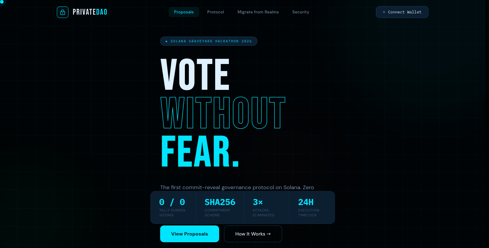

# PrivateDAO

<p align="center">
  <a href="https://x-pact.github.io/PrivateDAO/" target="_blank">
    
  </a>
</p>

[](https://x-pact.github.io/PrivateDAO/)
[](docs/index.html)
[](https://github.com/X-PACT/PrivateDAO/actions/workflows/ci.yml)
[](https://github.com/X-PACT/PrivateDAO/issues/5)
[](https://solana.com)
[](https://www.anchor-lang.com)
[](LICENSE)
[](SUBMISSION.md)

<p align="center">
  <a href="https://x-pact.github.io/PrivateDAO/"><strong>Open Interactive Frontend</strong></a> ·
  <a href="docs/index.html"><strong>Open Local Frontend File</strong></a>
</p>

Production-grade private governance for Solana DAOs using commit-reveal voting, timelocked execution, and treasury safety checks.

Built for Solana Graveyard Hackathon 2026 with focus on real security controls, Realms migration, and operational readiness.

---

## Executive Summary

Most DAO stacks reveal votes and interim tally in real time. That creates three high-risk dynamics:

- Vote buying during live tally swings.
- Whale intimidation and herd behavior.
- Treasury front-running once proposal direction is obvious.

PrivateDAO removes live tally visibility through commit-reveal and enforces delayed, auditable treasury execution.

---

## Core Capabilities

- Commit-reveal voting with hidden tally during voting phase.
- Voting modes:
  - Token-weighted
  - Quadratic
  - Dual-chamber (capital + community thresholds)
- Keeper-authorized reveal for voter liveness protection.
- Timelock and veto window before treasury execution.
- Treasury action validation (`SendSol`, `SendToken`, `CustomCPI`).
- Realms-compatible voter-weight record support.
- Migration helper from existing Realms governance setup.

---

## Security Posture

Key protections currently implemented:

- Commitment preimage binding:
  - `sha256(vote_byte || salt_32 || voter_pubkey_32)`
  - prevents replay across voters.
- Weight snapshot at commit time:
  - reduces post-vote token movement manipulation.
- Recipient and mint integrity checks for treasury execution:
  - blocks recipient substitution and mint mismatch.
- Token account ownership and authority checks before token transfers.
- Rent-safe reveal rebate logic:
  - rebate is transferred only if proposal account remains rent-exempt.
- Timelocked execution with explicit veto window.

---

## Protocol Flow

```text
1) Commit (voting open)
   - voters submit commitment hash only
   - tally remains hidden (YES=0 / NO=0)

2) Reveal (after voting_end)
   - voter or approved keeper reveals (vote, salt)
   - program verifies commitment and updates tally

3) Finalize (after reveal_end)
   - permissionless finalization computes result
   - if passed, execution unlock timestamp is set

4) Execute (after timelock)
   - permissionless execution fires treasury action
```

---

## Repository Layout

```text
programs/private-dao/src/lib.rs      Core Anchor program
tests/demo.ts                        Full lifecycle demo test
tests/full-flow-test.ts              End-to-end integration test
tests/private-dao.ts                 Unit/integration behavior tests
scripts/                             Operational and devnet scripts
migrations/migrate-realms-dao.ts     Realms migration tooling
docs/                                GitHub Pages documentation
```

---

## Local Development

### Prerequisites

- Rust stable toolchain
- Solana CLI
- Anchor CLI `0.32.1`
- Node.js + Yarn

### Build and test on local validator

```bash
yarn install
solana-test-validator --reset
anchor build
anchor test
```

Run only the full demo scenario:

```bash
anchor test -- --grep "demo"
```

---

## Devnet Deployment

### 1) Configure wallet and RPC

```bash
export ANCHOR_WALLET=~/.config/solana/id.json
solana config set --keypair "$ANCHOR_WALLET" --url https://api.devnet.solana.com
```

### 2) Fund wallet (RPC rotation + retries)

```bash
bash scripts/fund-devnet.sh 2
```

### 3) Optional custom faucet endpoint

If you run your own faucet service, the funding script can call it first:

```bash
export CUSTOM_FAUCET_URL="https://your-faucet-domain/api/airdrop"
export CUSTOM_FAUCET_METHOD="POST"
bash scripts/fund-devnet.sh 2
```

### 4) Deploy

```bash
anchor build
anchor deploy --provider.cluster devnet
```

### 5) Validate deployed programs or addresses

```bash
bash scripts/check-contracts.sh DnQTB3T6xWenyi7LYRsDADfqrKwGJntAaxStaePVkzhs
```

---

## CI and Quality Gates

Current CI enforces:

- Toolchain verification
- Anchor build
- Anchor test
- Non-real-code scan (non-production artifacts)

Manual verification locally:

```bash
bash scripts/verify.sh tools
bash scripts/verify.sh build
bash scripts/verify.sh test
bash scripts/verify.sh scan
```

---

## Global Grant Targets (2026)

These programs are highly relevant for security-focused DAO infrastructure, privacy tooling, and open-source public goods.

| Program | Why it fits PrivateDAO | Official link |
|---|---|---|
| Solana Foundation Grants | Solana-native infra, public goods, security tooling | https://solana.org/grants |
| Superteam Earn Grants | Regional Solana grants for shipping teams | https://earn.superteam.fun/grants |
| Gitcoin Grants Program | Public-goods funding with strong OSS visibility | https://www.gitcoin.co/program |
| Ethereum Foundation ESP | Grants for open-source infra, tooling, and research | https://esp.ethereum.foundation/ |
| NLnet Funding / NGI0 | Privacy and open internet digital commons grants | https://nlnet.nl/funding.html |
| Filecoin Foundation Grants | Open-source infra, research, and protocol-level tooling | https://fil.org/grants |

Submission windows and eligibility change frequently. Verify open calls and scope before applying.

---

## Documentation and Demo Assets

- Web documentation entry: `docs/index.html`
- Logo assets: `docs/assets/logo.png`
- Program source: `programs/private-dao/src/lib.rs`

---

## License

MIT License

Copyright (c) 2026 X-PACT
