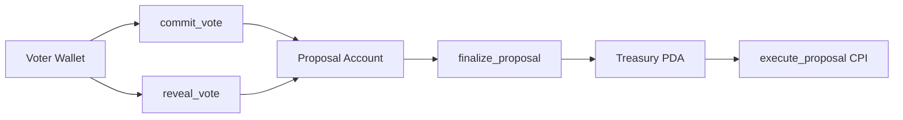

# PrivateDAO 🪦→🔐

<p align="center">
  
</p>

   

> **Commit-reveal governance for Solana. Built for Solana Graveyard Hackathon 2026.**
> Targeting: DAOs track (Realms $5K) · Migrations track (Sunrise $7K) · Overall ($15K)

---

## Why DAOs ended up in the graveyard

Every vote on Realms, Squads, or SPL Governance is public the moment it's cast. This created three structural problems that no one fixed:

| Problem | How it plays out |
|---------|-----------------|
| **Vote buying** | Whale watches live tally, pays wallets to flip their vote in the final hour |
| **Whale intimidation** | Small holders see a big wallet vote YES and flip their own vote to match |
| **Treasury front-running** | A "buy Token X" proposal starts passing. Bots see it and buy ahead of the treasury |

These aren't theoretical. They happened in Compound, MakerDAO, Uniswap. They're happening on Solana right now.

**PrivateDAO fixes the root cause — public voting — not the symptoms.**

---

## How it works

Three phases. Tally shows `0/0` until after voting closes.

```
Phase 1 — COMMIT (voting open)
  voter sends:  sha256(vote || salt || voter_pubkey)
  chain shows:  Commits: 127  |  YES: 0  |  NO: 0

Phase 2 — REVEAL (after voting_end)
  voter proves: (vote=true, salt=0xabc...)
  chain checks: sha256(vote || salt || pubkey) == stored commitment ✓
  chain shows:  Commits: 127  |  YES: 74  |  NO: 45

Phase 3 — FINALIZE (after reveal_end, permissionless)
  anyone calls: finalize_proposal()
  result:       PASSED ✅  |  treasury executes automatically
```

---

## What makes this different

### 🏗️ Quadratic voting (new on Solana)

Standard token-weighted voting means a whale with 10,000 tokens dominates a holder with 100. PrivateDAO's quadratic mode: **weight = √(token balance)**.

```
10,000 tokens → weight  3,162  (10x tokens, 3.16x power)
 1,000 tokens → weight  1,000
   100 tokens → weight    316
```

The community can actually govern. And because the tally is hidden, the whale can't even see if their √(10,000) is winning or losing.

### 🔑 Keeper-based auto-reveal

The biggest UX problem with commit-reveal: "what if I forget to reveal?"

At commit time, a voter sets a `voter_reveal_authority`. A keeper (any trusted wallet) can submit the reveal on their behalf if the voter doesn't. The keeper can't change the vote — only the voter holds the salt.

```typescript
// commit with keeper authorization
await commitVote(commitment, keeper.publicKey)

// if voter forgets — keeper submits the reveal
await revealVote(vote, salt, { signer: keeper })
```

### 💸 Real treasury execution (fully wired)

Proposals pass → treasury action executes inside `finalize_proposal` via CPI:
- `SendSol` → `system_program::transfer` from treasury PDA
- `SendToken` → `token::transfer` from treasury token account
- `CustomCPI` → emits event for relayer (extensible)

### 🔌 Realms plugin (zero migration)

Implements `spl-governance-addin-api` VoterWeightRecord layout exactly. Any existing Realms DAO adds private voting as a plugin — no token migration, no proposal disruption.

### 🌅 Migrate from Realms (Sunrise track)

`migrate_from_realms` takes your Realms governance pubkey + governance token and creates a mirrored PrivateDAO. Everything stays. Voting becomes private.

---

## Running it locally (no devnet needed)

```bash
# 1. Install dependencies
yarn install

# 2. Start local validator (in a separate terminal)
solana-test-validator --reset

# 3. Build
anchor build

# 4. Run the full demo — shows all 3 phases + quadratic + keeper
anchor test -- --grep "demo"
```

The demo runs in ~30 seconds on localnet. Shows the full lifecycle including a case where quadratic voting reverses the result vs token-weighted voting.

### Deploy to devnet

```bash
# use your local wallet (same one used for deploy authority)
export ANCHOR_WALLET=~/.config/solana/id.json
solana config set --keypair "$ANCHOR_WALLET" --url https://api.devnet.solana.com

# fund (with retries + RPC rotation)
bash scripts/fund-devnet.sh 2

# build + deploy
anchor build
anchor deploy --provider.cluster devnet

# create a DAO
yarn create-dao -- --name "MyDAO" --quorum 51 --mode quadratic

# full flow
yarn commit -- --proposal <PDA> --vote yes
yarn reveal -- --proposal <PDA>
yarn finalize -- --proposal <PDA>
```

For CI deploy, use GitHub Actions workflow `Deploy to Devnet` with `SOLANA_PRIVATE_KEY` in repository secrets (optionally `HELIUS_API_KEY`).

### Low-spec local machine

If your local machine is resource-constrained, run heavy checks in GitHub Actions:

```bash
gh workflow run CI
gh run watch
```

The `CI` workflow now supports manual trigger (`workflow_dispatch`) in addition to push/PR.

### Verify existing devnet contracts

If you already have Rust contracts/programs on devnet, inspect them before wiring integration:

```bash
bash scripts/check-contracts.sh <ADDRESS_1> <ADDRESS_2>
```

This prints executable flag, owner program, lamports, data size, and Solscan links.

### Migrate from Realms

```bash
yarn migrate -- \
  --governance <REALMS_GOVERNANCE_PUBKEY> \
  --name "MyDAO-Private" \
  --mint <GOVERNANCE_TOKEN_MINT>
```

---

## Project structure

```
programs/private-dao/src/lib.rs      Anchor program — all logic
tests/demo.ts                        Full demo (run with anchor test)
tests/private-dao.ts                 Unit tests
scripts/                             CLI scripts
  create-dao.ts
  create-proposal.ts
  commit-vote.ts
  reveal-vote.ts
  finalize.ts
migrations/migrate-realms-dao.ts     Sunrise migration tool
```

---

## Commitment scheme

```
preimage  = vote_byte (1B) || salt (32B) || voter_pubkey (32B)  =  65 bytes
commitment = sha256(preimage)  stored as [u8; 32] in VoterRecord
```

voter_pubkey in the preimage prevents a replay attack: without it, voter B could copy voter A's commitment and reveal with the same salt, double-counting a vote. With the pubkey, the commitment is voter-specific.

32-byte salt: 2^256 possible values — brute-forcing is computationally impossible.

---

## Honest tradeoffs

- **Reveal friction** — voters must return after voting closes. Keeper mechanism + SOL rebate help, but it's still two steps. ZK proofs remove this (planned v2).
- **Timing correlation** — attacker watching tx timestamps could infer patterns. Full privacy needs ZK.
- **Quadratic Sybil risk** — splitting tokens across wallets games quadratic mode. A KYC/Sybil-resistance layer is a plugin point, not in scope.

---

## License

MIT

---

## Hackathon Submission Pack

### What it is
PrivateDAO is a Solana governance protocol that uses commit-reveal voting with optional quadratic weighting and dual-chamber thresholds.

### Why it matters
It reduces vote buying, whale intimidation, and treasury front-running by sealing tallies until reveal/finalization windows.

### How it works
1. Commit phase: voters submit SHA-256 commitment hashes.
2. Reveal phase: voters (or approved keepers) reveal vote+salt proofs.
3. Finalize/execute phase: anyone finalizes; treasury execution is timelocked.

### Quickstart (Devnet)
```bash
yarn install
bash scripts/fund-devnet.sh
anchor build
anchor deploy
```

### Security considerations
- Commitments include voter pubkey to prevent replay.
- Weight snapshots are taken at commit time.
- Timelock + veto allow emergency intervention before execution.

### Known limitations
- Commit-reveal is two-step UX.
- Quadratic mode needs Sybil-resistance policy at DAO layer.
- Devnet faucet rate limits can delay deployment.

### Demo guide
- GitHub Pages main entry: `docs/index.html`
- Demo walkthrough section: `#demo` on the same page.
- Root HTML entry retained: `privatedao-frontend.html`

### Judges quick checklist
1. `anchor build` passes.
2. `anchor test` passes locally.
3. Non-real-code grep scan returns clean (excluding lockfiles).
4. Devnet funding script executes with retries/RPC rotation.

### Architecture diagram


### Share snippets
**X / Twitter**
```text
PrivateDAO brings commit-reveal governance to Solana: hidden tallies, quadratic + dual-chamber voting, keeper-assisted reveals, and timelocked treasury execution. Built for real DAO ops. #Solana #DAO #Anchor
```

**Discord**
```text
We shipped PrivateDAO: a production-grade commit-reveal governance protocol on Solana with timelocked execution and Realms migration support. Review the demo + tests in the repo.
```

**Solana forums**
```text
PrivateDAO introduces private governance primitives (commit/reveal/finalize/execute) with DualChamber voting and migration tooling for existing Realms communities.
```

**Hackathon form (short)**
```text
PrivateDAO is a Solana governance protocol that prevents live-tally manipulation using commit-reveal voting, supports quadratic/dual-chamber modes, integrates with Realms through voter-weight records, and enforces timelocked treasury execution.
```
