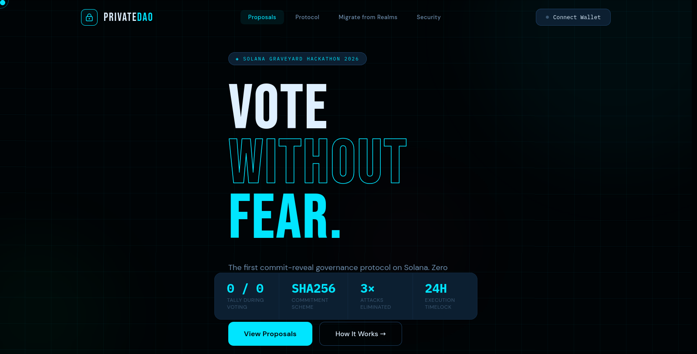
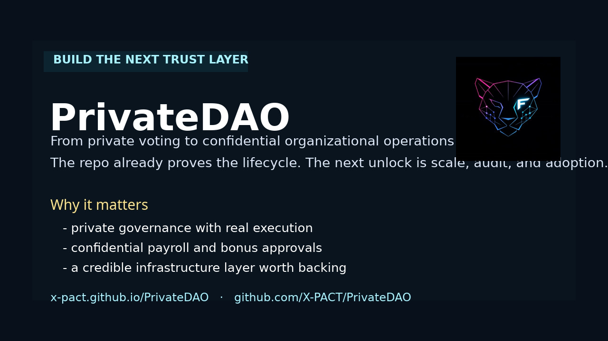

<!-- SPDX-License-Identifier: AGPL-3.0-or-later -->
# PrivateDAO

<p align="center">
  <a href="https://x-pact.github.io/PrivateDAO/" target="_blank">
    
  </a>
</p>

[](https://x-pact.github.io/PrivateDAO/)
[](https://x-pact.github.io/PrivateDAO/)
[](docs/android-native.md)
[](docs/android-native.md)
[](docs/awards.md)
[](https://solana.com)
[](docs/awards.md)
[](docs/index.html)
[](https://github.com/X-PACT/PrivateDAO/actions/workflows/ci.yml)
[](https://solana.com)
[](https://www.anchor-lang.com)
[](LICENSE)
[](SUBMISSION_FINAL.md)
[](docs/assets/private-dao-investor-pitch.mp4)
[](https://solscan.io/account/5AhUsbQ4mJ8Xh7QJEomuS85qGgmK9iNvFqzF669Y7Psx?cluster=devnet)
[](docs/security-review.md)
[](docs/threat-model.md)
[](docs/replay-analysis.md)
[](docs/failure-modes.md)
[](docs/zk-upgrade.md)
[](docs/zk-stack.md)
[](docs/zk-threat-extension.md)
[](docs/zk-layer.md)
[](docs/cryptographic-integrity.md)
[](docs/pdao-token.md)
[](docs/pdao-attestation.generated.json)
[](docs/confidential-payments.md)

PrivateDAO is a Solana governance protocol for DAOs that want private voting without giving up execution safety. Votes are committed privately, revealed later, finalized deterministically, and treasury execution stays behind an explicit timelock with recipient and mint checks.

The problem statement is simple and easy for judges to verify: public live tallies create whale pressure, vote buying, and treasury signaling. PrivateDAO removes live vote visibility while keeping the rest of the governance lifecycle inspectable, testable, and compatible with how Solana teams actually operate.

## About This Repository

PrivateDAO is both:

- a live Solana governance product
- and a full engineering repository for private voting, treasury safety, confidential compensation, and reviewer-visible operational evidence

This repository is not a thin smart-contract demo. It includes the program, product surface, Devnet runtime flows, backend read path, cryptographic review layer, and operational artifacts needed to inspect how the system behaves under real governance conditions.

## What PrivateDAO Ships

PrivateDAO currently ships five integrated layers:

1. Governance protocol
   - commit, reveal, finalize, execute, veto, cancel, delegation, treasury controls
2. Product surface
   - wallet-connected web app
   - Android-native path
   - live proposal, treasury, confidential payout, and REFHE flows
3. Cryptographic layer
   - SHA-256 vote commitments
   - Groth16 companion proof stack
   - on-chain proof anchors
   - on-chain verification receipts
   - proposal-level `zk_enforced` mode
4. Confidential treasury layer
   - encrypted payroll and bonus manifests
   - aggregate settlement execution
   - REFHE proposal-bound encrypted evaluation envelopes
5. Operations and review layer
   - backend read node and pooled RPC reads
   - runtime diagnostics
   - generated attestations and manifests
   - Devnet evidence and readiness artifacts

## About The Architecture

PrivateDAO is designed as a product-first governance stack with explicit boundaries:

- writes stay wallet-signed in the client
- treasury authority does not move to the backend
- backend infrastructure is read-only
- cryptographic evidence is visible without pretending that every path is already full on-chain verifier enforcement
- operational readiness is tracked in generated artifacts, not left as prose claims

This is why the repository contains both live UX and reviewer-facing evidence: the product and the trust model are meant to reinforce each other.

## Repository Map

Use this map first if you want to orient quickly:

- `programs/private-dao/src/lib.rs`
  - the on-chain governance, confidential payout, zk, and REFHE program logic
- `docs/index.html`
  - the live product surface and runtime panel
- `tests/private-dao.ts`
  - end-to-end lifecycle coverage
- `scripts/`
  - build, verification, Devnet, runtime, and review automation
- `scripts/run-read-node.ts`
  - read-only backend node for pooled RPC reads and operator metrics
- `scripts/configure-refhe-envelope.ts`
  - proposal-bound REFHE envelope configuration
- `scripts/settle-refhe-envelope.ts`
  - REFHE settlement before confidential payout execution
- `docs/live-proof.md`
  - canonical Devnet proof path
- `docs/security-review.md`
  - enforced security boundaries and reasoning
- `docs/zk-layer.md`
  - current zk architecture and limits
- `docs/pdao-token.md`
  - live governance token surface

## Fast Review Path

For the fastest high-signal review:

1. Open the live app: `https://x-pact.github.io/PrivateDAO/`
2. Read `docs/live-proof.md`
3. Read `docs/security-review.md`
4. Read `docs/zk-layer.md`
5. Read `docs/confidential-payments.md`
6. Read `docs/refhe-protocol.md`
7. Read `docs/read-node-indexer.md`
8. Read `docs/read-node-same-domain-deploy.md`
9. Read `docs/phase-c-hardening.md`
10. Read `docs/zk-verifier-strategy.md`
11. Read `docs/canonical-verifier-boundary-decision.md`
12. Read `docs/zk-external-closure.generated.md`

## Proposal Draft

- Local draft for copy/paste into a shared Google Doc: `docs/developer-tooling-proposal.md`

## Token Surface

PrivateDAO now publishes a live Devnet governance voting token surface that is also the canonical governance mint for the current reviewer-facing DAO:

- Token: `PDAO`
- Network: `Devnet`
- Utility: `Governance Voting Token`
- Platform: `DeAura`
- Mint: `AZUkprJDfJPgAp7L4z3TpCV3KHqLiA8RjHAVhK9HCvDt`
- Program: `Token-2022`
- Initial supply: `1,000,000 PDAO`

The protocol still supports DAO-configured governance mints on-chain. The current canonical Devnet DAO now uses `PDAO` itself as that live governance mint.

There is only one canonical PrivateDAO governance program id:

- `5AhUsbQ4mJ8Xh7QJEomuS85qGgmK9iNvFqzF669Y7Psx`

The separate `Token-2022` program id shown for `PDAO` belongs to the token mint surface and is expected. It is not a second PrivateDAO governance program.

## Governance Token Model

The PrivateDAO governance token provides a structured participation layer for proposal creation, voting, and treasury-facing governance decisions.

It exists to make governance more accountable, reduce spam, and reinforce lifecycle safety through an identifiable governance-access surface rather than open-ended participation.

See:

- `docs/token.md`
- `docs/pdao-token.md`

## Consumer Product Surface

PrivateDAO can be understood not only as a governance protocol, but as a community-facing product for treasuries that need private voting without losing execution safety.

The strongest product framing is:

- a wallet-connected governance app for community treasuries
- a token-gated participation surface for members
- a mobile-accessible voting flow for creator groups, clubs, and gaming communities

The current repository already supports that framing through:

- a live web app
- an Android-native path
- a live DeAura-launched governance token surface
- token-gated proposal participation
- explicit user-facing proposal, vote, and execution flows
- encrypted salary and bonus batch approvals with aggregate on-chain settlement

See:

- `docs/consumer-readiness.md`
- `docs/consumer-user-flows.md`
- `docs/launch-growth-plan.md`
- `docs/use-cases.md`
- `docs/economic-model.md`
- `docs/confidential-payments.md`
- `docs/confidential-payroll-flow.md`

## Confidential Payroll And Bonus

PrivateDAO now supports confidential payout plans as a first-class governance feature.

This adds a controlled compensation path for:

- payroll epochs
- contributor bonuses
- grant rounds
- committee-approved payout batches

The current model is intentionally strict and honest:

- the full payroll or bonus manifest stays encrypted off-chain
- the proposal stores only immutable hashes plus aggregate settlement metadata
- execution remains proposal-bound, timelocked, and treasury-safe
- the live frontend exposes the feature directly during proposal creation and execution

Use these notes first:

- `docs/confidential-payments.md`
- `docs/confidential-payroll-flow.md`
- `docs/confidential-payments-diagram.md`
- `docs/confidential-payments-audit-scope.md`

## REFHE Protocol

PrivateDAO now includes a real REFHE protocol layer for confidential treasury operations.

REFHE is not marketed as fully homomorphic execution on-chain. The implemented model is stronger and more honest:

- encrypted payroll and bonus inputs remain off-chain
- the proposal stores immutable hashes and aggregate payout metadata
- a proposal-bound `RefheEnvelope` PDA binds:
  - model URI
  - policy hash
  - input ciphertext hash
  - evaluation key hash
  - result ciphertext hash
  - result commitment hash
  - proof bundle hash
  - verifier program
- if the REFHE envelope exists, confidential payout execution is blocked until the envelope is settled on-chain

Primary references:

- `docs/refhe-protocol.md`
- `docs/refhe-operator-flow.md`
- `docs/refhe-security-model.md`
- `docs/refhe-audit-scope.md`
- `docs/assets/refhe-flow.svg`

Primary commands:

```bash
DAO_PDA="$DAO_PDA" PROPOSAL_PDA="$PROPOSAL_PDA" \
REFHE_MODEL_URI="box://privatedao/refhe/payroll-eval-epoch-7" \
REFHE_POLICY_HASH="$REFHE_POLICY_HASH" \
REFHE_INPUT_HASH="$REFHE_INPUT_HASH" \
REFHE_EVALUATION_KEY_HASH="$REFHE_EVALUATION_KEY_HASH" \
npm run configure:refhe -- --dao "$DAO_PDA" --proposal "$PROPOSAL_PDA" --model-uri "$REFHE_MODEL_URI" --policy-hash "$REFHE_POLICY_HASH" --input-ciphertext-hash "$REFHE_INPUT_HASH" --evaluation-key-hash "$REFHE_EVALUATION_KEY_HASH"

DAO_PDA="$DAO_PDA" PROPOSAL_PDA="$PROPOSAL_PDA" \
REFHE_RESULT_CIPHERTEXT_HASH="$REFHE_RESULT_CIPHERTEXT_HASH" \
REFHE_RESULT_COMMITMENT_HASH="$REFHE_RESULT_COMMITMENT_HASH" \
REFHE_PROOF_BUNDLE_HASH="$REFHE_PROOF_BUNDLE_HASH" \
REFHE_VERIFIER_PROGRAM="$REFHE_VERIFIER_PROGRAM" \
npm run settle:refhe -- --dao "$DAO_PDA" --proposal "$PROPOSAL_PDA" --result-ciphertext-hash "$REFHE_RESULT_CIPHERTEXT_HASH" --result-commitment-hash "$REFHE_RESULT_COMMITMENT_HASH" --proof-bundle-hash "$REFHE_PROOF_BUNDLE_HASH" --verifier-program "$REFHE_VERIFIER_PROGRAM"

PROPOSAL_PDA="$PROPOSAL_PDA" npm run inspect:refhe -- --proposal "$PROPOSAL_PDA"
```

## Backend Read Node And RPC Pool

PrivateDAO no longer needs to behave like a browser-only RPC client for heavy reads.

The repository now includes a real backend read path:

- pooled Devnet RPC endpoints
- cached proposal and DAO inspection
- wallet-readiness inspection per DAO
- runtime health responses
- rate limiting and bounded CORS
- read-only HTTP endpoints designed for same-domain deployment behind a reverse proxy

This keeps the trust model intact:

- writes still stay wallet-signed in the frontend
- treasury authority does not move to the backend
- the backend serves as a resilient read and indexing layer

Start locally:

```bash
cd /home/x-pact/PrivateDAO
npm run start:read-node
```

Verify:

```bash
cd /home/x-pact/PrivateDAO
npm run verify:read-node
```

Backend surfaces now expose:

- `/api/v1/ops/overview`
  - proposal, ZK, confidential payout, and REFHE coverage
- `/api/v1/ops/snapshot`
  - runtime, backend coverage, deployment guidance, and operator checks in one payload
- `/api/v1/devnet/profiles`
  - staged load-test profiles including the 350-wallet seven-wave saturation plan

The Runtime Panel consumes these backend summaries automatically when the read node is available, so REFHE coverage and 350-wave readiness are visible without falling back to browser-only inference.

Generate a reviewer-facing backend snapshot:

```bash
cd /home/x-pact/PrivateDAO
npm run build:read-node-snapshot
npm run verify:read-node-snapshot
npm run build:read-node-ops
npm run verify:read-node-ops
```

Primary backend docs:

- `docs/read-node-indexer.md`
- `docs/read-node-same-domain-deploy.md`
- `docs/rpc-architecture.md`
- `docs/backend-operator-flow.md`
- `docs/read-node-snapshot.generated.md`
- `docs/read-node-ops.generated.md`

## Domain Mirror Strategy

The current review surface stays stable at:

- `https://x-pact.github.io/PrivateDAO/`

If a `.xyz` domain is introduced, the safe rollout path is to deploy it as a parallel mirror first rather than replacing the current review URL during active review.

See:

- `docs/domain-mirror.md`

## Reviewer Clarifications

The current review surface is intentionally explicit about a few points that are easy to misread from partial scans:

- The canonical PrivateDAO governance program id is `5AhUsbQ4mJ8Xh7QJEomuS85qGgmK9iNvFqzF669Y7Psx`.
- The separate `Token-2022` id shown for `PDAO` belongs to the token mint surface only and is not a second governance deployment.
- Browser-native commit flows generate salts in memory and ask the voter to save or export them. They are not persisted in `localStorage` or `sessionStorage`.
- Replay protection is proposal-scoped through proposal-bound commitments, `VoteRecord` PDA binding, reveal account binding, and lifecycle flags. The current commitment preimage is `sha256(vote_byte || salt_32 || proposal_pubkey_32 || voter_pubkey_32)`.
- Reveal rebate comes from the proposal account only when that account remains rent-safe. The treasury is not the rebate source.
- The current Groth16 proof stack still generates and verifies proofs off-chain, while proposal-bound zk proof anchors are now recorded on-chain for the canonical Devnet governance flow. The deployed on-chain program remains the enforcement boundary.
- Phase A is live: on-chain proof anchors plus on-chain parallel verification receipts.
- Phase B is now live in parallel: proposals can be configured into `zk_enforced` mode once vote, delegation, and tally verification receipts exist on chain. The frontend surfaces this mode directly and switches finalize to the `zk_enforced` path for those proposals.
- The stronger path is now stricter than the original Phase A receipts: `zk_enforced` proposals require vote, delegation, and tally receipts recorded in `zk_enforced` mode, not only `parallel` mode.
- The web surface now shows per-layer receipt strength for the selected proposal, and the CLI now exposes:
  - `npm run anchor:zk-verify:enforced`
  - `npm run inspect:zk-proposal -- --proposal <PDA>`
- Confidential payout plans already emit Anchor events on-chain:
  - `ConfidentialPayoutConfigured`
  - `ConfidentialPayoutExecuted`
- The frontend now supports a real backend read path through the read node and falls back to direct RPC only when the backend is unavailable.
- The selected proposal panel now shows `zk_enforced` readiness directly, including whether receipts are missing, still parallel, or already strong enough for promotion.
- The repo now includes a dedicated `zk_enforced` runtime capture registry and generated review package so stronger-path wallet runs can be added without changing the reviewer surface.
- The repo now also includes explicit `zk_enforced` capture templates, an external audit scope, and a canonical verifier-boundary decision document so the remaining external work is structured instead of implied.
- Confidential payroll and bonus batches are now proposal-bound sidecar accounts. The chain exposes only aggregate settlement metadata and immutable hashes for the encrypted manifest, while the detailed recipient sheet remains off-chain.
- Phase C is not yet promoted. `zk_enforced` is live and usable, but it is still in hardening mode until additional runtime evidence, external review, and operator confidence are closed.

## ZK Rollout Status

The current zk roadmap is additive and non-breaking:

- Phase A
  - commit-reveal remains canonical
  - proposal-bound proof anchors are on chain
  - parallel verification receipts are on chain
- Phase B
  - proposals can opt into `zk_enforced`
  - `zk_enforced` now requires stronger receipt mode than the original Phase A parallel-only path
  - the frontend exposes ZK mode, policy state, and the alternate finalize path
  - the CLI finalize path auto-detects policy PDAs and uses the correct instruction
- Phase C
  - after operational stability and additional testing, `zk_enforced` can become the stronger production-grade path

For the exact blockers and execution path, read:

- `docs/phase-c-hardening.md`
- `docs/zk-verifier-strategy.md`
- `docs/zk-enforced-threat-review.md`
- `docs/zk-enforced-runtime-evidence.md`
- `docs/zk-enforced-operator-flow.md`
- `docs/zk-enforced-runtime.generated.md`
- `docs/zk-external-audit-scope.md`
- `docs/canonical-verifier-boundary-decision.md`
- `docs/zk-external-closure.generated.md`

## Why PrivateDAO Exists

Public governance leaks intent too early.

That creates predictable failure modes:

- whale pressure
- vote buying
- treasury signaling
- execution manipulation around visible intent

PrivateDAO exists to resist those failure modes with:

- commit-reveal voting
- state-machine governance
- timelocked execution
- strict treasury validation
- replay-resistant lifecycle checks
- tamper-evident proof artifacts
- layered Groth16 proof surfaces for vote, delegation, and tally integrity

## What Is Implemented

What is real in the current implementation:

- voting is executed on-chain through the Solana program
- proposal accounts are read live from on-chain program state
- any wallet holding the DAO governance token can create a proposal
- commit, reveal, finalize, cancel, veto, and execute are implemented in the program
- confidential salary and bonus batches can be configured and executed through proposal-bound payout plan PDAs
- the operator scripts print real transaction signatures and Solscan links for verification

The current stack is already structured for immediate **mainnet transition**. The lifecycle, permissions, execution checks, and operator flows are live on-chain today; moving from devnet to mainnet is an operational deployment step, not a product redesign.

## Security At A Glance

PrivateDAO is designed around one core requirement: preventing governance manipulation without sacrificing execution safety.

Current security hardening covers:

- lifecycle bypass resistance
- commit-reveal integrity
- signer and authority validation
- proposal and account binding correctness
- treasury miswiring rejection
- duplicate execution prevention
- failed-path state preservation
- replay-oriented reasoning and coverage mapping
- sha256-based artifact integrity across critical proof materials
- machine-readable zk attestation across registry and transcript layers
- lockfile and manifest attestation across Cargo, npm, and Yarn surfaces

See:

- `docs/security-review.md`
- `docs/threat-model.md`
- `docs/security-coverage-map.md`
- `docs/failure-modes.md`
- `docs/replay-analysis.md`
- `docs/cryptographic-integrity.md`
- `docs/cryptographic-posture.md`
- `docs/supply-chain-security.md`
- `docs/supply-chain-attestation.generated.json`
- `docs/cryptographic-manifest.generated.json`

## Why Security Is Core

PrivateDAO is not trying to make governance merely private. It is trying to make private governance defensible.

A private voting system that can be replayed, misbound, bypassed, or mis-executed would fail the exact problem it claims to solve.

That is why PrivateDAO treats lifecycle enforcement, signer correctness, account binding, replay resistance, and treasury safety as core protocol guarantees.

The same rule now applies to the review surface itself: zk artifacts, live-proof anchors, and the canonical proof documents are tied together through a sha256 manifest so reviewers can verify artifact integrity instead of trusting static presentation.

## Essential Links

- Live frontend: `https://x-pact.github.io/PrivateDAO/`
- Proof Center: `https://x-pact.github.io/PrivateDAO/?page=proof`
- Wallet diagnostics: `https://x-pact.github.io/PrivateDAO/?page=diagnostics`
- Live devnet proof: `docs/live-proof.md`
- Security review: `docs/security-review.md`
- PDAO token surface: `docs/pdao-token.md`
- ZK layer: `docs/zk-layer.md`
- Audit packet: `docs/audit-packet.generated.md`
- Review attestation: `docs/review-attestation.generated.json`
- Runtime attestation: `docs/runtime-attestation.generated.json`
- Verification gates: `docs/verification-gates.md`

## Product And Runtime Docs

- Android native guide: `docs/android-native.md`
- Consumer readiness: `docs/consumer-readiness.md`
- Consumer user flows: `docs/consumer-user-flows.md`
- Launch and growth plan: `docs/launch-growth-plan.md`
- Read node and indexer: `docs/read-node-indexer.md`
- RPC architecture: `docs/rpc-architecture.md`
- Backend operator flow: `docs/backend-operator-flow.md`
- Read-node snapshot: `docs/read-node-snapshot.generated.md`
- Fair-voting flow: `docs/fair-voting.md`
- Wallet runtime compatibility: `docs/wallet-runtime.md`
- Real-device runtime intake: `docs/real-device-runtime.md`
- Real-device runtime evidence: `docs/real-device-runtime.generated.md`
- Runtime attestation: `docs/runtime-attestation.generated.json`
- Runtime evidence package: `docs/runtime-evidence.generated.md`
- Operational evidence package: `docs/operational-evidence.generated.md`
- Wallet compatibility matrix: `docs/wallet-compatibility-matrix.generated.md`
- Devnet canary: `docs/devnet-canary.generated.md`
- 50-wallet load report: `docs/load-test-report.md`
- Devnet scale profiles: `docs/devnet-scale-profiles.md`
- 350-wallet wave plan: `docs/devnet-350-wave-plan.md`
- Multi-proposal isolation report: `docs/devnet-multi-proposal-report.md`
- Race and collision report: `docs/devnet-race-report.md`
- RPC and stale-blockhash resilience report: `docs/devnet-resilience-report.md`

## Security And Cryptography Docs

- Confidential payouts note: `docs/confidential-payments.md`
- Confidential payroll flow: `docs/confidential-payroll-flow.md`
- Confidential payouts diagram: `docs/confidential-payments-diagram.md`
- Confidential payouts audit scope: `docs/confidential-payments-audit-scope.md`
- Threat model: `docs/threat-model.md`
- Security coverage map: `docs/security-coverage-map.md`
- Failure modes: `docs/failure-modes.md`
- Replay analysis: `docs/replay-analysis.md`
- ZK upgrade path: `docs/zk-upgrade.md`
- ZK stack: `docs/zk-stack.md`
- ZK threat extension: `docs/zk-threat-extension.md`
- ZK assumption matrix: `docs/zk-assumption-matrix.md`
- ZK capability matrix: `docs/zk-capability-matrix.md`
- ZK provenance: `docs/zk-provenance.md`
- ZK verification flow: `docs/zk-verification-flow.md`
- ZK registry: `docs/zk-registry.generated.json`
- ZK transcript: `docs/zk-transcript.generated.md`
- ZK attestation: `docs/zk-attestation.generated.json`
- ZK evidence: `docs/zk-evidence.md`
- Cryptographic integrity: `docs/cryptographic-integrity.md`
- Cryptographic posture: `docs/cryptographic-posture.md`
- Supply-chain security: `docs/supply-chain-security.md`
- Supply-chain attestation: `docs/supply-chain-attestation.generated.md`
- Cryptographic manifest: `docs/cryptographic-manifest.generated.json`

## Release And Mainnet Docs

- Authority hardening: `docs/authority-hardening.md`
- Mainnet go-live checklist: `docs/mainnet-go-live-checklist.md`
- Mainnet readiness report: `docs/mainnet-readiness.generated.md`
- Mainnet acceptance matrix: `docs/mainnet-acceptance-matrix.generated.md`
- Mainnet proof package: `docs/mainnet-proof-package.generated.md`
- Deployment attestation: `docs/deployment-attestation.generated.json`
- Go-live attestation: `docs/go-live-attestation.generated.json`
- Release ceremony: `docs/release-ceremony.md`
- Release drill evidence: `docs/release-drill.generated.md`
- Artifact freshness: `docs/artifact-freshness.md`
- Review automation: `docs/review-automation.md`
- Go-live criteria: `docs/go-live-criteria.md`
- Operational drillbook: `docs/operational-drillbook.md`
- External readiness intake: `docs/external-readiness-intake.md`
- Wallet compatibility matrix: `docs/wallet-compatibility-matrix.generated.md`
- Devnet canary: `docs/devnet-canary.generated.md`
- Devnet wallet registry: `docs/devnet-wallet-registry.json`
- Devnet bootstrap record: `docs/devnet-bootstrap.json`
- Devnet transaction registry: `docs/devnet-tx-registry.json`
- Adversarial report: `docs/adversarial-report.json`
- ZK proof registry: `docs/zk-proof-registry.json`
- Performance metrics: `docs/performance-metrics.json`
- Devnet release manifest: `docs/devnet-release-manifest.md`
- Proof registry: `docs/proof-registry.json`
- Technical explainer package: `docs/investor-video.md`
- Repo-native investor reel: `https://x-pact.github.io/PrivateDAO/assets/private-dao-investor-pitch.mp4`
- On-chain program: `programs/private-dao/src/lib.rs`
- End-to-end lifecycle test: `tests/full-flow-test.ts`

## Reviewer Fast Path

If a judge only has 2-3 minutes, the strongest review order is:

1. Open `https://x-pact.github.io/PrivateDAO/?page=security`
2. Open `docs/threat-model.md`
3. Open `docs/security-review.md`
4. Open `tests/private-dao.ts`
5. Open `tests/full-flow-test.ts`
6. Open `docs/security-coverage-map.md`
7. Open the live proof note and devnet explorer references

Condensed reviewer handoff:

- `docs/reviewer-fast-path.md`

## Ranger / Drift Fit

PrivateDAO is strongest for Ranger and Drift when it is framed honestly:

- not as a complete seeded vault strategy by itself
- but as the private governance and risk-control layer for a real USDC strategy stack

That is the differentiated value in these competitions:

- hidden committee approvals
- timelocked execution discipline
- treasury and execution checks
- real on-chain proof for governance-sensitive actions

Submission references for this angle:

- `docs/ranger-strategy-documentation.md`
- `docs/strategy-operations.md`
- `docs/ranger-submission-checklist.md`
- `docs/ranger-main-track.md`
- `docs/ranger-drift-track.md`
- `docs/judge-technical-audit.md`
- `docs/security-review.md`

Core review commands:

```bash
npm run verify:all
```

Packaged review handoff:

```bash
npm run build:review-bundle
```

Artifact freshness gate for deterministic reviewer artifacts:

```bash
npm run verify:artifact-freshness
```

Full gate breakdown:

- `docs/verification-gates.md`

This verification layer is also enforced in CI, so the reviewer-facing evidence path, live-proof references, and ops package are checked on every push and pull request.

## Threat Coverage

Reviewer-visible coverage currently includes:

- lifecycle bypass
- replay and duplicate execution
- signer misuse
- PDA and account substitution
- treasury miswiring
- invalid reveal and commitment mismatch
- timing boundary misuse
- delegation misuse
- execution invariants
- failed-path atomicity

The formal mapping lives in `docs/security-coverage-map.md`.

## ZK Overlay

PrivateDAO now includes a real zero-knowledge companion stack without changing the deployed contracts or the current frontend lifecycle.

What exists today:

- a real Circom circuit
- Groth16 setup artifacts
- witness generation
- proof generation
- proof verification

What it proves today:

- boolean vote form
- minimum-weight eligibility
- proposal and DAO scoped commitment binding
- proposal-scoped nullifier binding

This is an additive zk layer for the current system, not a hidden protocol rewrite.

Primary references:

- `docs/zk-upgrade.md`
- `docs/zk-architecture.md`
- `docs/zk-evidence.md`
- `zk/circuits/private_dao_vote_overlay.circom`

## Artifact Integrity

PrivateDAO now adds a non-breaking **Cryptographic Integrity Layer** on top of the zk and review surfaces.

ZK proves validity. Cryptographic integrity proves the review artifacts themselves have not been altered.

What exists today:

- sha256 hashes for critical zk artifacts
- sha256 hashes for critical live-proof and canonical proof artifacts
- a generated manifest in `docs/cryptographic-manifest.generated.json`
- automated verification through `npm run verify:cryptographic-manifest`

Why it matters:

- reviewer-facing proof becomes tamper-evident
- zk evidence can be verified as artifacts, not only described in prose
- the evidence package is held to a cryptographic integrity standard, not just a documentation standard

How to verify:

```bash
npm run build:cryptographic-manifest
npm run verify:cryptographic-manifest
npm run verify:all
```

Primary references:

- `docs/cryptographic-integrity.md`
- `docs/cryptographic-manifest.generated.json`

## Known Limitations

PrivateDAO is explicit about what remains limited:

- the project is devnet-first
- commit-reveal hides vote content, not transaction timing metadata
- `CustomCPI` remains intentionally unsupported in the live execution surface
- local validator startup is environment-sensitive in this shell
- mainnet audit completeness is not claimed

## Documentation Index

Security and review documents:

- `docs/security-review.md`
- `docs/threat-model.md`
- `docs/security-coverage-map.md`
- `docs/failure-modes.md`
- `docs/replay-analysis.md`
- `docs/protocol-spec.md`
- `docs/security-architecture.md`
- `docs/security-guarantees.md`
- `docs/protocol-maturity.md`
- `docs/judge-technical-audit.md`
- `docs/mainnet-readiness.md`
- `docs/production-operations.md`
- `docs/monitoring-alerts.md`
- `docs/incident-response.md`
- `docs/mainnet-cutover-runbook.md`
- `docs/operator-checklist.md`
- `docs/risk-register.md`
- `docs/audit-handoff.md`
- `docs/reviewer-surface-map.md`
- `docs/independent-verification.md`
- `docs/attack-simulation-log.md`
- `docs/devnet-release-manifest.md`
- `docs/proof-registry.json`
- `docs/cryptographic-integrity.md`
- `docs/cryptographic-manifest.generated.json`
- `docs/artifact-freshness.md`
- `docs/zk-layer.md`
- `docs/zk-upgrade.md`
- `docs/zk-architecture.md`
- `docs/zk-evidence.md`

Protocol and product documents:

- `docs/live-proof.md`
- `docs/strategy.md`
- `docs/android-native.md`
- `docs/awards.md`
- `docs/ranger-strategy-documentation.md`
- `docs/strategy-blueprint.md`
- `docs/strategy-adaptor-interface.md`
- `docs/strategy-operations.md`
- `docs/risk-policy.md`
- `docs/performance-evidence.md`
- `docs/submission-dossier.md`
- `docs/submission-registry.json`
- `docs/competition-readiness.md`
- `docs/audit-packet.generated.md`
- `docs/review-attestation.generated.json`
- `docs/verification-gates.md`
- `docs/review-automation.md`
- `docs/reviewer-fast-path.md`
- `docs/use-cases.md`
- `docs/economic-model.md`
- `docs/consumer-readiness.md`
- `docs/consumer-user-flows.md`
- `docs/launch-growth-plan.md`
- `zk/circuits/private_dao_vote_overlay.circom`

## Independent Verification

If you want to verify the system without trusting any summary, start here:

- `docs/independent-verification.md`

This guide is designed to let an external reviewer:

- set up the environment
- reproduce the lifecycle
- inspect transaction hashes
- verify treasury balance changes
- reproduce rejection paths

## Attack Simulation Log

Compact reviewer-facing misuse attempts are indexed in:

- `docs/attack-simulation-log.md`

## ⚡ One-Line Install

Bootstrap the repository with a single command:

```bash
curl -fsSL https://raw.githubusercontent.com/X-PACT/PrivateDAO/main/scripts/install.sh | bash
```

The installer:

- checks required tools
- creates `.env` from `.env.example` when missing
- installs Node dependencies
- prints the next real steps for demo and build

## Android Native App

PrivateDAO now includes a real Android-native app under `apps/android-native/`.

This mobile app is built as an Android-first counterpart of the current project because Solana Mobile Wallet Adapter is the official mobile dApp path for Android today. The stack is:

- Kotlin native
- Jetpack Compose
- Solana Mobile Wallet Adapter
- Devnet by default

What the Android app mirrors from the current product:

- same devnet program ID
- same proposal phases and lifecycle
- same PDA derivations
- same commit-reveal semantics
- same governance terminology
- same proof-first positioning for judges and reviewers

Current Android-native mobile support:

- create DAO
- deposit treasury
- connect wallet through MWA
- load DAOs and proposals from devnet
- inspect proposal details and phase
- create proposal
- commit vote
- reveal vote
- finalize proposal
- execute proposal for SOL and token treasury paths
- view tx signatures and explorer links
- view awards / credibility surface

Android-native system diagram:

```text
Android wallet user
  -> Compose UI
  -> PrivateDaoViewModel
  -> PrivateDaoRepository
  -> Mobile Wallet Adapter
  -> Solana devnet RPC + PrivateDAO program
  -> tx signature + explorer link back to the app
```

Reference:

- Native app root: `apps/android-native/`
- Android guide: `docs/android-native.md`

## Live Devnet Proof

The repository now includes a captured real governance run on devnet with explorer links for:

- deploy
- create DAO
- mint voting power
- deposit treasury
- create proposal
- commit
- reveal
- finalize
- execute

Reference: `docs/live-proof.md`

## Devnet Stress Harness

The repository now includes a full wave-based Devnet stress and adversarial simulation package using 50 persistent wallets:

- 35 voter wallets
- 10 adversarial wallets
- 5 zk tester wallets
- 223 public Devnet transaction entries
- 50 adversarial scenarios
- 7 Groth16 proof artifacts

It also now includes reviewer-facing extended Devnet evidence for:

- multi-proposal isolation across three live proposals in the same DAO
- cross-proposal voter-record and delegation-marker rejection
- permissionless finalize collision races
- permissionless execute collision races
- dead-end RPC failover recovery
- stale blockhash rejection and rebuilt transaction recovery

Reviewer-facing artifacts:

- `docs/load-test-report.md`
- `docs/operational-evidence.generated.md`
- `docs/devnet-multi-proposal-report.md`
- `docs/devnet-race-report.md`
- `docs/devnet-resilience-report.md`
- `docs/devnet-wallet-registry.json`
- `docs/devnet-bootstrap.json`
- `docs/devnet-tx-registry.json`
- `docs/adversarial-report.json`
- `docs/zk-proof-registry.json`
- `docs/performance-metrics.json`

Unified reproducible command:

- `npm run test:devnet:all`

Sustained operational command:

- `npm run ops:canary`

## 🏆 Awards & Recognition

PrivateDAO-related engineering work has been recognized in competitive Solana development challenges.

### 🥇 1st Place — Superteam Earn

- **Challenge:** Rebuild production backend systems as on-chain Rust programs
- **Position:** 1st Place
- **Platform:** Superteam Poland
- **Date:** March 2026

**Summary:**

This achievement recognizes 1st Place in the challenge **"Rebuild production backend systems as on-chain Rust programs"** on Superteam Poland.

The system demonstrates:

- State-based architecture modeling
- Permission and execution logic
- Distributed system design patterns
- Real-world backend workflow translation

#### 🔗 Reference

- Platform: https://earn.superteam.fun
- Repository: https://github.com/X-PACT/PrivateDAO
- Demo: https://x-pact.github.io/PrivateDAO/
- Award note: `docs/awards.md`

## On-Chain Execute Surface

The win documentation is separate from governance execution.

- The award section documents only the verified 1st Place result.
- The `Execute` button belongs to proposal lifecycle handling and appears only when a proposal is executable on-chain after finalize plus timelock expiry.
- The frontend maps the button to the repo execution flow instead of pretending execution is a decorative UI action.
- The Proof Center now also exposes wallet-connected `Finalize in Wallet` and `Execute in Wallet` actions for compatible live proposals.
- The live UI now also supports browser-native `Create Proposal`, `Commit`, and `Reveal` flows for the standard governance path, while keeping the equivalent repo commands visible for reviewers and operators.
- The live UI now also exposes proposal-scoped delegation actions and live per-proposal transaction history from devnet RPC for the selected proposal.
- The authority surface now also includes wallet-connected `Cancel` and `Veto` actions for the selected proposal, and proposal activity is labeled from parsed on-chain transaction logs rather than shown as raw signatures only.
- The reveal surface now supports keeper-style reveal by targeting a voter record explicitly when the keeper was authorized at commit time.
- The operator surface now also supports browser-native `Create DAO` and `Deposit Treasury` actions instead of leaving those steps as command-only flows.
- The operator command is:

```bash
PROPOSAL_PUBKEY="$PROPOSAL_PUBKEY" yarn execute -- --proposal "$PROPOSAL_PUBKEY"
```

GitHub Pages source: `docs/` via `.github/workflows/pages.yml`.

## One-Line Pitch

PrivateDAO brings commit-reveal voting, proposal-scoped private delegation, keeper-assisted reveal, and timelocked treasury execution to Solana DAOs in one working stack.

## 🎬 Technical Explainer Package

<p align="center">
  <a href="https://x-pact.github.io/PrivateDAO/assets/private-dao-investor-pitch.mp4" target="_blank">
    
  </a>
</p>

- Strategy documentation for judges, partners, and technical reviewers: `https://us04docs.zoom.us/doc/Zd34HEaHSKyZGRxBcqxXQg`
- Watch the repo-native investor reel: `https://x-pact.github.io/PrivateDAO/assets/private-dao-investor-pitch.mp4`
- Investor video brief and production package: `docs/investor-video.md`
- Voiceover script: `docs/video-voiceover.md`
- Shotlist and visual direction: `docs/video-shotlist.md`
- Poster asset: `docs/assets/private-dao-investor-pitch-poster.png`

The explainer now reflects the current system state directly:

- protocol hardening
- zero-knowledge companion layer
- cryptographic artifact integrity
- web and Android-native review surfaces
- live devnet proof and reviewer verification paths

## 🧪 Local Demo

Run the repository demonstration end-to-end with:

```bash
npm run demo
```

This exercises the real lifecycle through Anchor tests, including proposal creation, commit, reveal, finalize, execute, delegation, and cancellation.

## 🧭 System Diagram

```text
Users
  DAO authority
  Governance token holder
  Operator / evaluator

Client surface
  docs/index.html live frontend
  scripts/*.ts operator flows
  sdk/src/index.ts commitment helpers

On-chain core
  programs/private-dao/src/lib.rs

Accounts
  DAO PDA
  Proposal PDA
  VoteRecord PDA
  Treasury PDA
  VoterWeightRecord

Verification
  tests/full-flow-test.ts
  tests/demo.ts
  Solscan tx and account links
```

## 🏛️ Account And Execution Diagram

```text
Initialize DAO
  -> DAO PDA stores authority, governance mint, quorum, reveal window, and execution delay
  -> token holder creates proposal
  -> Proposal PDA stores title, status, voting_end, reveal_end, and treasury_action
  -> commit_vote
  -> VoteRecord PDA stores commitment, weight snapshot, keeper, and delegation context
  -> reveal_vote
  -> proposal tallies update on-chain
  -> finalize_proposal
  -> if passed, execution_unlocks_at is set
  -> execute_proposal
  -> treasury action executes with recipient and mint checks
```

## 🚀 Mainnet Transition Readiness

PrivateDAO is already built around a real on-chain lifecycle, which makes the mainnet move straightforward in architecture terms:

- the program logic is not mocked and already enforces commit, reveal, finalize, veto, and execute
- proposal creation is already permissioned by real governance token ownership
- execution is already timelocked and checked on-chain
- the frontend and scripts already read and operate against real program state
- the repository already contains the proof surface expected before a mainnet cutover: tests, docs, scripts, and explorer-oriented outputs

In practical terms, architecture readiness alone is not the last mile. Mainnet cutover still depends on external audit coverage, runtime QA across supported wallets and devices, production custody controls, monitoring, and release discipline.

Mainnet blockers still outside the repository are:

- external audit completion
- multisig-based authority hardening
- real-device wallet captures
- zk_enforced runtime captures for enable-mode and finalize
- production RPC and monitoring operations
- same-domain backend read node deployment is strongly recommended before mainnet, even though the browser still retains direct RPC fallback

## 🧩 Project Surface Map

- 🦀 `programs/private-dao/src/lib.rs`: the on-chain source of truth for DAO initialization, proposal lifecycle, commit-reveal voting, timelock, veto, treasury execution, delegation, keeper reveal, and Realms-oriented migration.
- 📦 `sdk/src/index.ts`: shared commitment utilities for generating salts, encoding vote envelopes, and matching the on-chain `sha256(vote || salt || proposal || pubkey)` flow.
- 🛠️ `scripts/`: operator workflows for DAO creation, proposal creation, deposit, delegation, commit, reveal, finalize, execute, and migration.
- 🧪 `tests/private-dao.ts`, `tests/full-flow-test.ts`, `tests/demo.ts`: behavioral coverage for the governance lifecycle, treasury execution, and walkthrough-grade demonstrations.
- 🌐 `docs/index.html`: the live GitHub Pages frontend that explains the protocol, surfaces proposal state, and now exposes awards and recognition content.
- 🔄 `migrations/migrate-realms-dao.ts`: migration entry point for DAOs preserving Realms provenance while moving into PrivateDAO.

## 🔁 Lifecycle Diagram

```text
Initialize DAO
  -> Create Proposal
  -> Commit vote hashes
  -> Reveal vote and salt
  -> Finalize outcome
  -> if passed: timelock window -> veto or execute
  -> if not passed: failed / cancelled / vetoed terminal states
```

## Why This Stands Out

- The protocol is live on Solana devnet, not simulated.
- The governance lifecycle is complete: create, commit, reveal, finalize, veto, cancel, and execute.
- The repository contains the product surface, protocol surface, and proof surface in one place.
- The project now has both a live web surface and an Android-native mobile surface.
- The problem is easy for judges to understand: public tallies leak intent too early.

## Current Product Surface

- Live devnet program: `5AhUsbQ4mJ8Xh7QJEomuS85qGgmK9iNvFqzF669Y7Psx`
- GitHub Pages frontend: `docs/index.html`
- Android-native app: `apps/android-native/`
- End-to-end lifecycle tests: `tests/full-flow-test.ts`, `tests/demo.ts`
- Operator scripts: `scripts/`
- Live proof note: `docs/live-proof.md`

## Quick Review Pack

- Live frontend: `https://x-pact.github.io/PrivateDAO/`
- Judge Mode: `https://x-pact.github.io/PrivateDAO/?page=proof&judge=1`
- Proof Center: `https://x-pact.github.io/PrivateDAO/?page=proof`
- Android-native guide: `docs/android-native.md`
- Main submission: `SUBMISSION.md`
- Final-form submission: `SUBMISSION_FINAL.md`
- Demo script: `DEMO_SCRIPT_90S.md`

## Ownership And Contact

PrivateDAO is independently built and maintained by **Fahd Kotb**.

- Primary email: [fahd.kotb@tuta.io](mailto:fahd.kotb@tuta.io)
- Secondary email: [i.kotb@proton.me](mailto:i.kotb@proton.me)
- Operations email: [eslamkotb.fmt@gmail.com](mailto:eslamkotb.fmt@gmail.com)
- Additional contact: [eslamkotb.369@gmail.com](mailto:eslamkotb.369@gmail.com)
- WhatsApp: [+20 112 403 0209](https://wa.me/201124030209)
- WhatsApp backup: [+20 107 000 4967](https://wa.me/201070004967)
- X: [@FahdX369](https://x.com/FahdX369)
- Telegram: [@Fahdkotb](https://t.me/Fahdkotb)

## What Exists Today

- Commit-reveal voting with hidden tally during the voting window
- Voting modes:
  - `TokenWeighted`
  - `Quadratic` under an external sybil-resistance / identity policy
  - `DualChamber`
- Treasury actions:
  - `SendSol`
  - `SendToken`
  - `CustomCPI` reserved / rejected
- Proposal-scoped private delegation
- Optional proposal-scoped keeper reveal
- Timelock and veto model
- Realms-oriented migration and voter-weight compatibility path
- Android-native mobile app using Kotlin + Solana Mobile Wallet Adapter

## Safety Model

Current on-chain safety properties:

- Commitment binding uses `sha256(vote_byte || salt_32 || proposal_pubkey_32 || voter_pubkey_32)`
- Cross-proposal replay resistance is enforced through proposal-bound commitments, proposal-bound `VoteRecord` PDAs, and commit/reveal lifecycle flags
- Vote weight is snapshotted at commit time
- Browser-native commit flows generate salts in memory only and do not persist them in `localStorage` or `sessionStorage`
- Reveal is limited to the voter or the voter-approved proposal-scoped keeper, and successful reveal clears that keeper authority from the stored record
- Direct commit and proposal-scoped delegation are now mutually exclusive on-chain through proposal-bound marker accounts
- Cancelled proposals can no longer progress through reveal/finalize/execute
- Finalization is permissionless but only after `reveal_end`
- Execution is permissionless but only after `execution_unlocks_at`
- Veto is only possible while the proposal is passed, unexecuted, and still inside the timelock window
- Treasury SOL execution enforces the configured recipient
- Treasury token execution enforces:
  - treasury token account owned by the treasury PDA
  - action mint matches both token accounts
  - recipient token owner matches the configured recipient
  - source and destination token accounts are not the same account
- Unsupported `CustomCPI` actions are rejected rather than marked executed as an event-only success path
- Reveal rebate is paid from the proposal account only when it remains rent-safe
- Delegation is one-shot per proposal and self-delegation is rejected
- `CustomCPI` is intentionally unsupported and does not claim arbitrary on-chain CPI execution

This is still not a claim of audit completeness. It is a real protocol with real checks, not a claim that governance risk is solved forever.

## Repository Layout

```text
programs/private-dao/src/lib.rs      Anchor program
tests/private-dao.ts                 Core behavior tests
tests/full-flow-test.ts              End-to-end lifecycle + treasury tests
tests/demo.ts                        Demo walkthrough test
scripts/                             CLI helpers for local/devnet operation
migrations/migrate-realms-dao.ts     Realms migration helper
sdk/src/index.ts                     SDK entrypoint
docs/                                GitHub Pages frontend and docs assets
```

## Local Development

Prerequisites:

- Rust stable
- Solana CLI
- Anchor CLI `0.31.1`
- Node.js
- Yarn or npm

Official Solana references used by this repo:

- RPC reference: https://solana.com/docs/rpc
- The project relies directly on standard JSON-RPC methods such as `getVersion`, `getAccountInfo`, `getProgramAccounts`, `getSlot`, and `getBlockTime`
- Commitment guidance from the Solana docs matters here:
  - use `confirmed` when tracking progress for dependent actions
  - use `finalized` when you need the safest read semantics

Current tool expectations for this repository:

- `solana` CLI is still expected for full local validator, deploy, and some shell workflows
- `@solana/web3.js` is what the current scripts, SDK, and docs frontend use today
- RPC-only fallbacks now exist for some checks, so not every operational script requires the Solana CLI just to inspect devnet state

Install dependencies:

```bash
yarn install
yarn typecheck
```

Start a validator in another terminal:

```bash
solana-test-validator --reset
```

Build:

```bash
anchor build
```

Run all tests:

```bash
anchor test
```

Run targeted suites:

```bash
anchor test -- --grep "PrivateDAO"
anchor test -- --grep "Full flow"
anchor test -- --grep "demo"
```

Run verification helpers:

```bash
bash scripts/verify.sh tools
bash scripts/verify.sh fmt
bash scripts/verify.sh lint
bash scripts/verify.sh build
bash scripts/verify.sh test
bash scripts/verify.sh scan
bash scripts/verify.sh rpc
bash scripts/verify.sh rpc-health-unit
bash scripts/verify.sh rpc-health
```

## Devnet Workflow

Set wallet and RPC:

```bash
export ANCHOR_WALLET=~/.config/solana/id.json
export ALCHEMY_API_KEY="<alchemy-key>"
solana config set \
  --keypair "$ANCHOR_WALLET" \
  --url "https://solana-devnet.g.alchemy.com/v2/${ALCHEMY_API_KEY}"
```

Fallbacks already supported by the scripts:

- `ALCHEMY_DEVNET_RPC_URL`
- `HELIUS_API_KEY`
- `QUICKNODE_DEVNET_RPC`
- `EXTRA_DEVNET_RPCS`
- `RPC_AUTH_HEADER`
- `CUSTOM_FAUCET_URL`
- `CUSTOM_FAUCET_METHOD`

RPC behavior note:

- `scripts/check-rpc-health.sh` validates RPC availability with `getVersion`
- the docs frontend and `yarn list-proposals` rely on account reads such as `getProgramAccounts`, `getSlot`, and `getBlockTime`
- `scripts/check-contracts.sh` now supports JSON-RPC fallback account inspection when `solana` CLI is not installed

Fund and sanity-check devnet access:

```bash
bash scripts/fund-devnet.sh 2
bash scripts/check-rpc-health.sh
```

Deploy:

```bash
anchor build
anchor deploy --provider.cluster devnet
```

Or use the repo deploy script:

```bash
./deploy.sh
```

Validate deployed addresses:

```bash
bash scripts/check-contracts.sh 5AhUsbQ4mJ8Xh7QJEomuS85qGgmK9iNvFqzF669Y7Psx
```

## Scripts

The CLI scripts are meant for actual local/devnet usage, not throwaway demo wrappers.

- `scripts/create-dao.ts`
- `scripts/create-proposal.ts`
- `scripts/deposit-treasury.ts`
- `scripts/list-proposals.ts`
- `scripts/delegate-vote.ts`
- `scripts/commit-vote.ts`
- `scripts/reveal-vote.ts`
- `scripts/finalize.ts`
- `scripts/execute.ts`

Example flow:

```bash
yarn create-dao -- --name "MyDAO" --quorum 51 --mode dual
DAO_PDA="$DAO_PDA" RECIPIENT_WALLET="$RECIPIENT_WALLET" PROPOSAL_PDA="$PROPOSAL_PDA"
yarn deposit -- --dao "$DAO_PDA" --amount 1.0
yarn create-proposal -- --dao "$DAO_PDA" --title "Fund research: 0.1 SOL" --treasury-recipient "$RECIPIENT_WALLET" --treasury-amount 0.1
yarn list-proposals -- --dao "$DAO_PDA"
yarn commit -- --proposal "$PROPOSAL_PDA" --vote yes
yarn reveal -- --proposal "$PROPOSAL_PDA"
yarn finalize -- --proposal "$PROPOSAL_PDA"
yarn execute -- --proposal "$PROPOSAL_PDA"
```

Token treasury flow:

```bash
DAO_PDA="$DAO_PDA"
RECIPIENT_WALLET="$RECIPIENT_WALLET"
TOKEN_MINT="$TOKEN_MINT"

yarn create-proposal -- \
  --dao "$DAO_PDA" \
  --title "Send treasury tokens" \
  --treasury-type token \
  --treasury-recipient "$RECIPIENT_WALLET" \
  --treasury-amount 1000000 \
  --treasury-mint "$TOKEN_MINT"
```

`--treasury-amount` for token actions is passed as raw token units.

Keeper reveal note:

- Salt files are stored as `~/.privatedao/salts/<proposal>-<voter>.json`
- The old `~/.privatedao/salts/<proposal>.json` path is still written as a legacy fallback

## Realms Compatibility

Two separate things exist here and should not be conflated:

1. `update_voter_weight_record` writes a Realms-style voter weight record account.
2. `migrate_from_realms` and `migrations/migrate-realms-dao.ts` let a DAO preserve provenance from an existing Realms governance address.

What is true today:

- The repo has a Realms-oriented migration path
- The DAO stores `migrated_from_realms`
- The voter-weight account shape is compatible with the plugin pattern

What is not claimed here:

- full proposal-by-proposal Realms replacement
- automatic Realms proposal mirroring
- a finished end-to-end Realms plugin integration across the whole governance lifecycle

The migration helper is useful. It is not pretending to be a complete Realms drop-in.

## Grants And Ecosystem Funding Fit

PrivateDAO is naturally aligned with the kinds of ecosystem support programs that care about real infra, migration tooling, governance safety, and developer usability.

- Solana Foundation:
  overall hackathon placement and broader ecosystem grant relevance
- Realms ecosystem:
  direct relevance because the repo includes a voter-weight record path and migration-oriented DAO tooling
- Sunrise ecosystem:
  direct relevance because the repo includes a migration helper instead of treating migration as a slide-only promise

This section is intentionally careful: it describes strategic fit, not confirmed sponsorship, grant receipt, or accelerator admission.

## Devnet vs Production Intent

Implemented and exercised now:

- devnet deployment
- local validator testing
- treasury SOL execution
- treasury SPL token execution
- keeper reveal
- delegation
- timelock and veto flow

Still intentionally scoped or deferred:

- `CustomCPI` remains outside the live execution surface rather than arbitrary CPI from the program
- no claim of mainnet audit readiness
- no claim of censorship-resistant off-chain relayer infrastructure
- no claim that commit-reveal hides metadata such as transaction timing
- no claim that the current Realms path is a full native replacement

## Limitations

- Unrevealed commitments count as abstentions for outcome purposes
- Commit-reveal hides vote choice, not participation timing
- Treasury actions are visible when proposals are created; the hidden part is the tally, not the existence of the proposal itself
- `CustomCPI` is intentionally conservative and does not execute arbitrary CPI on-chain
- Proposal and DAO account layouts are treated as compatibility-sensitive; this repo avoids silent breaking changes to those structures

## Supporting Docs

- `BUILD.md` for toolchain and deploy troubleshooting
- `GUIDE.md` for a longer operator walkthrough
- `SECURITY.md` for vulnerability reporting
- `RELEASE_CHECKLIST.md` for release hygiene
- `SUBMISSION.md` for the hackathon-facing writeup

## License

See `LICENSE`, `LICENSE-APACHE`, `LICENSE-MIT`, and `LICENSE-COMMERCIAL.md`.
Extended Devnet scale profiles:

```bash
npm run test:devnet:100
npm run test:devnet:350
npm run test:devnet:500
```

The canonical reviewer package remains the 50-wallet run, while larger profiles write to profile-specific artifacts so explorer-visible baseline evidence stays stable. The `350` profile is the strongest wave-based saturation profile inside the current harness: `50` wallets x `7` waves, pre-funded, retry-bounded, and mixed with negative-path coverage rather than pure happy-path traffic.
