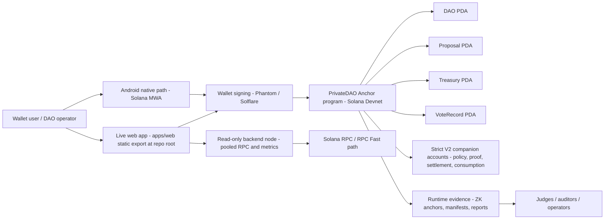
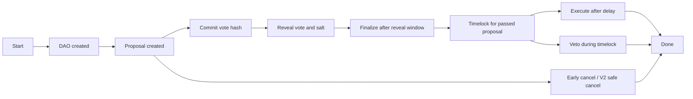
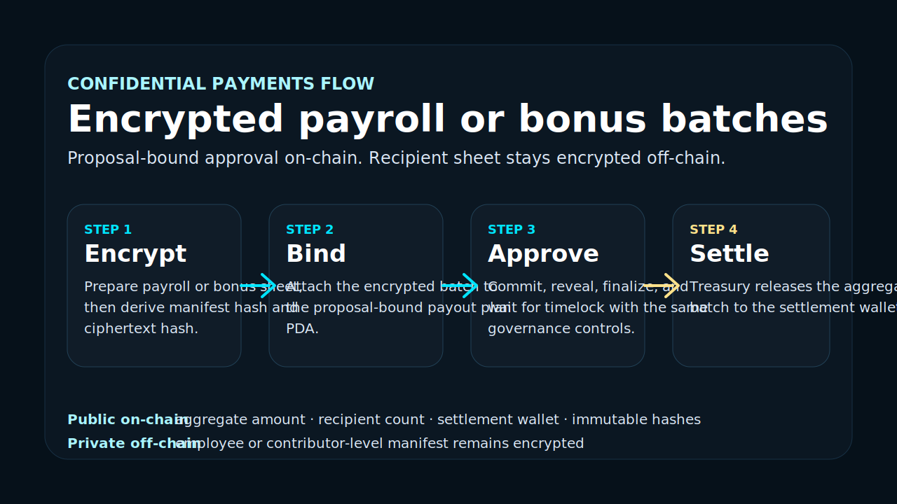
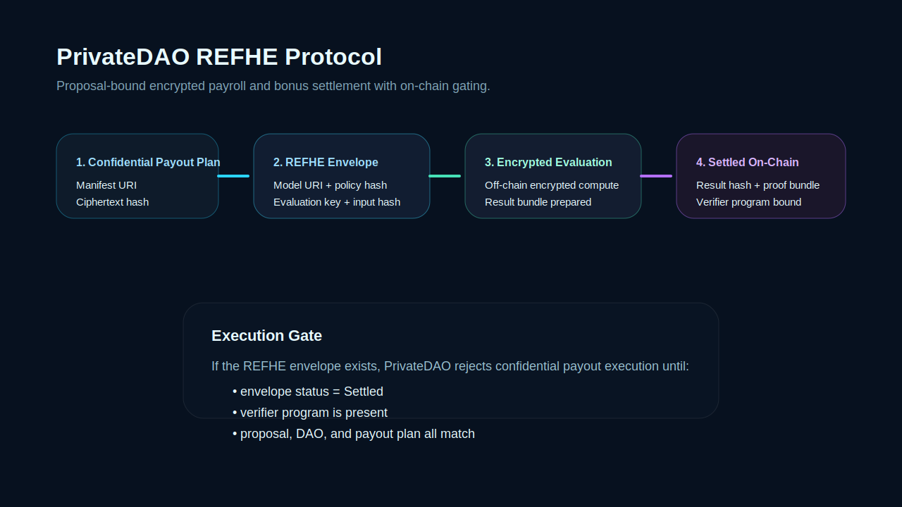
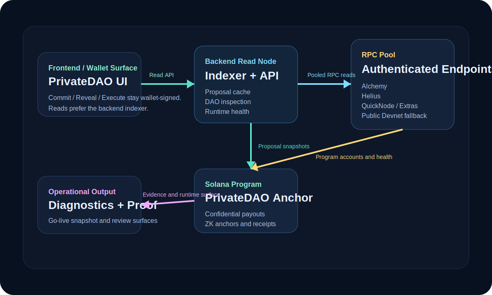

<!-- SPDX-License-Identifier: AGPL-3.0-or-later -->
# PrivateDAO

<p align="center">
  <a href="https://privatedao.org/" target="_blank">
    
  </a>
</p>

<p align="center">
  <strong>Private governance, confidential treasury operations, and audit-grade runtime evidence for Solana organizations.</strong>
</p>

<p align="center">
  <a href="https://privatedao.org/"></a>
  <a href="https://github.com/X-PACT/PrivateDAO/actions/workflows/ci.yml"></a>
  <a href="docs/awards.md"></a>
  <a href="https://solscan.io/account/5AhUsbQ4mJ8Xh7QJEomuS85qGgmK9iNvFqzF669Y7Psx?cluster=devnet"></a>
  <a href="docs/pdao-token.md"></a>
  <a href="docs/security-hardening-v2.md"></a>
  <a href="docs/operational-evidence.generated.md"></a>
  <a href="docs/magicblock/private-payments.md"></a>
  <a href="docs/rpc-architecture.md"></a>
  <a href="LICENSE"></a>
</p>

## Winner Signal

**Regional 1st Place recognition, March 2026.**

PrivateDAO engineering already carries a real first-place regional signal. That matters here because this repo is built the same way: live protocol code, live Devnet execution, explicit trust boundaries, and machine-checked reviewer evidence. See [`docs/awards.md`](docs/awards.md).

## What PrivateDAO Is

PrivateDAO is a Solana governance and treasury product for organizations that need privacy without losing operational discipline.

It combines:

- **Private voting:** commit-reveal governance with proposal-bound commitments.
- **Confidential treasury operations:** payroll, bonus, and payout flows with aggregate on-chain settlement state.
- **Execution safety:** timelocks, veto and cancel boundaries, duplicate-execution resistance, and strict treasury account validation.
- **Evidence and reviewability:** Devnet rehearsals, ZK proof anchors, runtime packets, manifests, and generated audit surfaces.
- **Operational packaging:** Realms migration, hosted read/API packaging, trust exports, pilot material, and operator docs.

## Why It Matters To The Ecosystem

PrivateDAO is being built as public-good governance and treasury infrastructure for Solana.

The goal is not only to ship one strong product surface. The goal is to make advanced governance, privacy, telemetry, and treasury discipline easier for the ecosystem to adopt, inspect, and build on.

That matters because the same core system can serve:

- grant and allocation committees
- treasury and payout governance
- protocol operating councils
- security-sensitive decisions
- contributor, vendor, and payroll-style payout workflows

## Clear Product Roadmap

The roadmap is intentionally simple and fundable:

1. make the wallet-first Devnet flow effortless for first-time visitors
2. keep proof, telemetry, custody, and diagnostics attached to the same product corridor
3. strengthen audit, monitoring, real-device wallet coverage, and settlement publication
4. close the remaining production gates and ship the strongest possible release candidate

## What Is Live Now

PrivateDAO is already a live Devnet product, not a concept deck:

- Anchor program on Solana Devnet
- Wallet-connected frontend
- Operational routes for onboarding, command, dashboard, proof, diagnostics, and services
- PDAO governance token surface
- Web wallet DAO bootstrap on Devnet
- Web wallet proposal submit on Devnet
- Repo-native and device-native proof paths for the broader governance lifecycle
- Confidential payout paths with `REFHE` and `MagicBlock` integration surfaces
- `Strict V2` hardening for proof, settlement, cancellation, and policy snapshots
- `Governance Hardening V3` for token-supply quorum snapshots and dedicated reveal rebate vaults
- `Settlement Hardening V3` for payout caps, evidence-aging windows, and explicit REFHE/MagicBlock execution requirements
- Backend read node and RPC Fast-oriented evidence path
- Reviewer-facing runtime, security, and launch packets

## Product Surface Split

The public product UI is intentionally responsible for:

- Connect Wallet
- Create DAO on Devnet from the connected web wallet
- Create Proposal on Devnet from the connected web wallet after live DAO bootstrap
- Commit Vote
- Reveal Vote
- Finalize Proposal
- Execute Proposal
- View Logs
- Diagnostics

The public repo and CLI remain available for:

- Advanced debugging
- Batch operations
- Emergency recovery
- Migration tools
- Stress tests

This keeps the buyer-facing product clean while preserving engineering and protocol discipline in the repo.

Current web/runtime boundary:

- `Create DAO` now has a live wallet-first Devnet bootstrap path in the web action workbench.
- `Create Proposal` now has a live wallet-first Devnet submit path in the same workbench once a live DAO bootstrap has already established the DAO lane, including the current live `SendSol` and `SendToken` treasury-motion lanes.
- `Commit Vote`, `Reveal Vote`, and `Finalize Proposal` now use the same live wallet-first workbench lane once a real DAO and proposal already exist in session state.
- `Execute Proposal` now also has a live wallet-first path for standard proposals and the current live `SendSol` and `SendToken` treasury-motion lanes.
- Repo-script lifecycle proof exists for the governance core, while browser-wallet proof on the web and real-device action proof on Android remain explicitly pending until they are captured in runtime evidence.
- `CustomCPI` still requires the richer payout path; the current live web builder now carries the supported treasury transfer variants, but it does not claim arbitrary treasury action coverage.

The rule is strict:

- If a normal user needs it, it belongs in the UI.
- If it is for protocol maintenance, incident handling, migrations, or engineering-only control, it belongs in the public repo and CLI.

## Colosseum Frontier 2026

PrivateDAO is actively being advanced during **Colosseum Frontier, April to May 2026**.

The public competition message stays simple:

- one coherent governance product
- private and confidential treasury operations
- clear runtime evidence and trust surfaces
- stronger operator and reviewer readability with each shipping tranche

## Launch Boundary

PrivateDAO is already strong enough for Devnet evaluation, judge review, and pilot packaging, and the current execution strategy is designed to convert that foundation into mainnet-grade readiness with the right support and closure evidence:

| Stage | Current status | Evidence |
| --- | --- | --- |
| Product and protocol | Implemented on Devnet | Live frontend, Anchor program, PDAO governance mint, commit-reveal lifecycle, confidential payout flows, Strict V2 hardening. |
| Reviewer evidence | Implemented and generated | 50-wallet Devnet rehearsal, ZK anchors, operational evidence, audit packet, cryptographic manifest, and `npm run verify:all`. |
| Launch operations | Repo-defined and ready for closure | Multisig intake, authority transfer runbook, launch ops checklist, monitoring rules, wallet E2E plan. |
| Production custody | Structured for execution with recorded evidence next | 2-of-3 multisig, 48+ hour timelock, authority transfer signatures, signer backups, and post-transfer authority readouts. |
| Mainnet real funds | Final production gate | External audit, live monitoring, real-device captures, source-verifiable MagicBlock/REFHE receipts, and final cutover ceremony. |

Operational launch docs:

- [`docs/mainnet-blockers.md`](docs/mainnet-blockers.md)
- [`docs/multisig-setup-intake.md`](docs/multisig-setup-intake.md)
- [`docs/authority-transfer-runbook.md`](docs/authority-transfer-runbook.md)
- [`docs/launch-ops-checklist.md`](docs/launch-ops-checklist.md)
- [`docs/monitoring-alert-rules.md`](docs/monitoring-alert-rules.md)
- [`docs/wallet-e2e-test-plan.md`](docs/wallet-e2e-test-plan.md)
- [`docs/launch-trust-packet.generated.md`](docs/launch-trust-packet.generated.md)
- [`docs/production-custody-ceremony.md`](docs/production-custody-ceremony.md)
- [`docs/external-audit-engagement.md`](docs/external-audit-engagement.md)
- [`docs/pilot-onboarding-playbook.md`](docs/pilot-onboarding-playbook.md)
- [`docs/browser-automation-audit.md`](docs/browser-automation-audit.md)
- [`docs/security-audit-remediation-2026-04-08.md`](docs/security-audit-remediation-2026-04-08.md)

The README should stay aligned with this rule: implemented surfaces are described as implemented; external launch steps are described as pending until real evidence is recorded.

## Canonical Custody Proof

The canonical custody source of truth is:

- [`docs/multisig-setup-intake.json`](docs/multisig-setup-intake.json)
- [`docs/custody-observed-readouts.json`](docs/custody-observed-readouts.json)
- [`docs/canonical-custody-proof.generated.md`](docs/canonical-custody-proof.generated.md)
- [`docs/custody-proof-reviewer-packet.generated.md`](docs/custody-proof-reviewer-packet.generated.md)
- [`docs/production-custody-ceremony.md`](docs/production-custody-ceremony.md)
- [`docs/authority-transfer-runbook.md`](docs/authority-transfer-runbook.md)
- [`docs/mainnet-blockers.md`](docs/mainnet-blockers.md)

Strict operator ingestion path:

1. Build the packet in `https://privatedao.org/custody/`
2. Save it locally as `docs/custody-evidence-intake.json`
3. Run `npm run apply:custody-evidence-intake`

Current official custody state from the canonical intake:

- status: `pending-external`
- production mainnet claim allowed: `false`
- network: `mainnet-beta`
- threshold target: `2-of-3`
- signer public keys recorded: `0/3`
- multisig implementation: `pending-selection`
- multisig address: `pending`
- timelock configuration evidence: `pending`
- rehearsal signature: `pending`
- upgrade / DAO / treasury transfer signatures: `pending`
- post-transfer authority readouts: `pending`
- current deployed authority readout observed on `devnet`: `4Mm5YTRbJuyA8NcWM85wTnx6ZQMXNph2DSnzCCKLhsMD`
- target-network program readout on `mainnet-beta`: `not found`

Live proof surface:

- `https://privatedao.org/custody/`
- `https://privatedao.org/documents/`
- `https://privatedao.org/documents/canonical-custody-proof/`
- `https://privatedao.org/documents/custody-proof-reviewer-packet/`
- `https://privatedao.org/documents/launch-trust-packet/`
- `https://privatedao.org/documents/mainnet-blockers/`

This is intentional: the product now exposes the exact custody proof shape and the live operating milestones around it, while the transfer ceremony keeps moving toward a reviewer-ready closeout with real addresses, signatures, explorer links, and readouts. The goal is not to overstate readiness. The goal is to keep making the system stronger, more credible, and more defensible with every serious execution tranche.

## Start Here

| If you need | Link |
| --- | --- |
| Live product | https://privatedao.org/ |
| Command center | https://privatedao.org/command-center/ |
| Governance dashboard | https://privatedao.org/dashboard/ |
| Custody workspace | https://privatedao.org/custody/ |
| Launch trust packet | https://privatedao.org/documents/launch-trust-packet/ |
| Reviewer telemetry packet | https://privatedao.org/documents/reviewer-telemetry-packet/ |
| Mainnet blockers | https://privatedao.org/documents/mainnet-blockers/ |
| Story video | https://privatedao.org/story/ |
| Community | https://privatedao.org/community/ |
| Judge / proof view | https://privatedao.org/proof/?judge=1 |
| Wallet diagnostics | https://privatedao.org/diagnostics/ |
| Services and buyer path | https://privatedao.org/services/ |
| Treasury receive surface | https://privatedao.org/services/ |
| Demo video MP4 | https://privatedao.org/assets/private-dao-demo-flow.mp4 |
| Devnet program | https://solscan.io/account/5AhUsbQ4mJ8Xh7QJEomuS85qGgmK9iNvFqzF669Y7Psx?cluster=devnet |
| Canonical custody intake | [`docs/multisig-setup-intake.json`](docs/multisig-setup-intake.json) |

The launch boundary is now surfaced in-product through `https://privatedao.org/custody/`, where multisig creation, authority transfer, and evidence requirements are shown as a live operating workflow rather than a hidden note.

## Competition Review Surfaces

PrivateDAO is being presented publicly as one coherent product during the current Colosseum Frontier cycle.

| Reviewer lane | Live workspace | Strongest visible fit |
| --- | --- | --- |
| Primary product lane | https://privatedao.org/tracks/colosseum-frontier/ | Product shell, trust surfaces, proof continuity, and buyer path |
| Confidential operations lane | https://privatedao.org/security/ | Commit-reveal governance, privacy-aware treasury motion, and settlement posture |
| Runtime and infrastructure lane | https://privatedao.org/analytics/ | Hosted reads, diagnostics, API packaging, and runtime evidence |

The operating rule stays strict:

- one product thesis
- multiple reviewer corridors under the same Frontier narrative
- no contradiction between site, README, deck, demo, or proof

## Strategic Opportunity Corridors

Beyond the primary Frontier judging posture, PrivateDAO is also being prepared for adjacent opportunities that strengthen the same commercial product thesis instead of fragmenting it.

| Corridor | Current strongest route | What it proves now |
| --- | --- | --- |
| Startup capital corridor | `https://privatedao.org/start/` -> `https://privatedao.org/story/` -> `https://privatedao.org/services/` | Startup-quality product shell, buyer corridor, and reviewer-safe trust packaging |
| Regional grant corridor | `https://privatedao.org/awards/` -> `https://privatedao.org/tracks/colosseum-frontier/` | Ecosystem credibility, product maturity, and proof continuity |
| Data and telemetry corridor | `https://privatedao.org/diagnostics/` -> `https://privatedao.org/analytics/` | Runtime evidence, indexed proposal state, and hosted-read credibility |
| Confidential payout corridor | `https://privatedao.org/security/` -> `https://privatedao.org/services/` -> `https://privatedao.org/custody/` | Private treasury approvals, encrypted operations framing, and custody-aware payout discipline |
| Audit and hardening corridor | `https://privatedao.org/documents/canonical-custody-proof/` -> `https://privatedao.org/diagnostics/` | Canonical custody truth, authority hardening, and incident-readiness posture |

Canonical strategic reference:

- [`docs/strategic-opportunity-readiness-2026.md`](docs/strategic-opportunity-readiness-2026.md)
- [`docs/reviewer-telemetry-packet.generated.md`](docs/reviewer-telemetry-packet.generated.md)
- [`docs/ecosystem-focus-alignment.generated.md`](docs/ecosystem-focus-alignment.generated.md)

## Ecosystem Focus Alignment

The current ecosystem-facing fit is documented in:

- [`docs/ecosystem-focus-alignment.generated.md`](docs/ecosystem-focus-alignment.generated.md)

This packet keeps the case disciplined across:

- decentralisation
- censorship resistance
- DAO tooling
- education
- developer tooling
- payments
- selective cause-driven fit

The rule remains strict: only corridors already visible in the live product are presented as shipped, and every area keeps an explicit next gap instead of inflated claims.

## Story And Community

These are the public-facing routes reviewers, users, and buyers should see first:

| Surface | Link |
| --- | --- |
| Story video route | https://privatedao.org/story/ |
| Weekly / public YouTube | https://www.youtube.com/@privatedao |
| Official Discord | https://discord.gg/PbM8BC2A |
| Colosseum project page | https://arena.colosseum.org/projects/explore/praivatedao |
| Guided product flow | [`docs/frontier-guided-flow.md`](docs/frontier-guided-flow.md) |
| Live proof V3 | [`docs/test-wallet-live-proof-v3.generated.md`](docs/test-wallet-live-proof-v3.generated.md) |
| Domain mirror plan | [`docs/domain-mirror.md`](docs/domain-mirror.md) |
| `.xyz` mirror checklist | [`docs/xyz-mirror-cutover-checklist.md`](docs/xyz-mirror-cutover-checklist.md) |
| Audit packet | [`docs/audit-packet.generated.md`](docs/audit-packet.generated.md) |
| Operational evidence | [`docs/operational-evidence.generated.md`](docs/operational-evidence.generated.md) |
| Frontier integration evidence | [`docs/frontier-integrations.generated.md`](docs/frontier-integrations.generated.md) |
| Reviewer telemetry packet | [`docs/reviewer-telemetry-packet.generated.md`](docs/reviewer-telemetry-packet.generated.md) |
| Mainnet blockers | [`docs/mainnet-blockers.md`](docs/mainnet-blockers.md) |
| Trust package | [`docs/trust-package.md`](docs/trust-package.md) |
| Service catalog | [`docs/service-catalog.md`](docs/service-catalog.md) |
| Investor / competition pitch deck | [`docs/investor-pitch-deck.md`](docs/investor-pitch-deck.md) |

## System Diagram


```mermaid
flowchart LR
  User["Wallet user / DAO operator"] --> Frontend["Live web app - apps/web static export at repo root"]
  User --> Android["Android native path - Solana MWA"]
  Frontend --> Wallet["Wallet signing - Phantom / Solflare"]
  Android --> Wallet
  Wallet --> Program["PrivateDAO Anchor program - Solana Devnet"]
  Program --> DAO["DAO PDA"]
  Program --> Proposal["Proposal PDA"]
  Program --> Treasury["Treasury PDA"]
  Program --> VoteRecord["VoteRecord PDA"]
  Program --> StrictV2["Strict V2 companion accounts - policy, proof, settlement, consumption"]
  Frontend --> ReadNode["Read-only backend node - pooled RPC and metrics"]
  ReadNode --> RPC["Solana RPC / RPC Fast path"]
  Program --> Evidence["Runtime evidence - ZK anchors, manifests, reports"]
  Evidence --> Reviewers["Judges / auditors / operators"]
```

## Governance Lifecycle


```mermaid
flowchart LR
  Start["Start"] --> DaoCreated["DAO created"]
  DaoCreated --> ProposalCreated["Proposal created"]
  ProposalCreated --> Commit["Commit vote hash"]
  Commit --> Reveal["Reveal vote and salt"]
  Reveal --> Finalize["Finalize after reveal window"]
  Finalize --> Timelock["Timelock for passed proposal"]
  Timelock --> Execute["Execute after delay"]
  Timelock --> Vetoed["Veto during timelock"]
  ProposalCreated --> Cancelled["Early cancel / V2 safe cancel"]
  Execute --> Done["Done"]
  Vetoed --> Done
  Cancelled --> Done
```

## Treasury Receive Configuration

The frontend can expose public treasury intake rails for:

- `SOL`
- `USDC`
- `USDG`

These are configured through public environment variables only:

- `NEXT_PUBLIC_TREASURY_RECEIVE_ADDRESS`
- `NEXT_PUBLIC_TREASURY_SOL_RECEIVE_ADDRESS`
- `NEXT_PUBLIC_TREASURY_USDC_RECEIVE_ADDRESS`
- `NEXT_PUBLIC_TREASURY_USDG_RECEIVE_ADDRESS`
- `NEXT_PUBLIC_TREASURY_USDC_MINT`
- `NEXT_PUBLIC_TREASURY_USDG_MINT`
- `NEXT_PUBLIC_TREASURY_NETWORK`

Use only public receive addresses here. Do not place signer keypairs, seed phrases, or treasury secrets in the frontend or this repository.

## Feature Map

| Layer | What exists now | Key references |
| --- | --- | --- |
| Governance core | DAO creation, proposal creation, commit, reveal, finalize, execute, veto, cancel, delegation, keeper reveal. | [`programs/private-dao/src/lib.rs`](programs/private-dao/src/lib.rs), [`tests/private-dao.ts`](tests/private-dao.ts) |
| Treasury execution | SOL and Token-2022/SPL treasury paths with recipient, mint, owner, and duplicate-execution checks. | [`docs/security-review.md`](docs/security-review.md), [`docs/failure-modes.md`](docs/failure-modes.md) |
| Confidential payouts | Proposal-bound payroll and bonus plans with encrypted manifests and aggregate settlement. | [`docs/confidential-payments.md`](docs/confidential-payments.md), [`docs/confidential-payroll-flow.md`](docs/confidential-payroll-flow.md) |
| Confidential Treasury Command Center | Live guided UI path that turns `Create -> Commit -> Reveal -> Execute` into one product flow, then explains proposal-by-proposal whether ZK, REFHE, MagicBlock, and backend-indexed RPC are active, optional, or not required. The builder now includes smart presets for standard treasury grants, confidential payroll, confidential bonus, and private token distribution. | [`apps/web`](apps/web), [`docs/frontier-guided-flow.md`](docs/frontier-guided-flow.md) |
| Checkout-like onboarding rail | The proposals page now starts with a storefront-style onboarding rail that walks normal users through product pack selection, DAO bootstrap, treasury funding, proposal launch, and private vote/execute flow before they reach the lower-level consoles. The storefront now personalizes hero CTAs and compare cards based on the selected operating pack. | [`apps/web`](apps/web) |
| Storefront and service entry | The homepage now exposes product packs, Realms migration as a first-class entry, and a service catalog for hosted API, review exports, onboarding, and pilot support without pretending a self-serve SaaS checkout already exists. | [`apps/web`](apps/web), [`docs/service-catalog.md`](docs/service-catalog.md), [`docs/migration-story.md`](docs/migration-story.md) |
| Commercial buyer surface | The homepage now also frames the commercial buying path directly in-product: pilot package, hosted read API + ops, confidential operations premium, and enterprise governance retainer, each linked to the exact pricing, SLA, trust, and onboarding documents behind it. | [`apps/web`](apps/web), [`docs/pricing-model.md`](docs/pricing-model.md), [`docs/pilot-program.md`](docs/pilot-program.md), [`docs/service-level-agreement.md`](docs/service-level-agreement.md) |
| Buyer journey narrative | The homepage now explains who should buy PrivateDAO, why it exists beyond Realms or Squads alone, what happens in the first 30 days of a pilot, and what is live now versus still pending-external for real-funds launch. | [`apps/web`](apps/web), [`docs/trust-package.md`](docs/trust-package.md), [`docs/mainnet-blockers.md`](docs/mainnet-blockers.md), [`docs/pilot-program.md`](docs/pilot-program.md) |
| Conversion-ready pilot rail | The homepage now includes a commercial checkout rail for weeks 1-4 of a pilot plus a `Request Pilot Packet` action that copies the exact buyer-facing packet from the current repo truth surface. | [`apps/web`](apps/web), [`docs/pilot-program.md`](docs/pilot-program.md), [`docs/pricing-model.md`](docs/pricing-model.md), [`docs/trust-package.md`](docs/trust-package.md) |
| Demo-closing hero proof strip | The hero now includes quick-switches for judge, buyer, and operator views plus a prominent live-success proof strip that surfaces the latest real Devnet execution, the new V3 hardening proof packet, the reviewer packet, and the explicit mainnet boundary from the first screen. | [`apps/web`](apps/web), [`docs/test-wallet-live-proof.generated.md`](docs/test-wallet-live-proof.generated.md), [`docs/test-wallet-live-proof-v3.generated.md`](docs/test-wallet-live-proof-v3.generated.md), [`docs/operational-evidence.generated.md`](docs/operational-evidence.generated.md), [`docs/mainnet-blockers.md`](docs/mainnet-blockers.md) |
| Persona-adaptive landing surface | The hero now shifts between buyer, judge, and operator narratives without changing the underlying proof links, and the proposals page now carries a sticky pack summary that turns the active preset into a clear operator and buyer brief. | [`apps/web`](apps/web), [`docs/grant-committee-pack.md`](docs/grant-committee-pack.md), [`docs/fund-governance-pack.md`](docs/fund-governance-pack.md), [`docs/enterprise-dao-pack.md`](docs/enterprise-dao-pack.md) |
| Commercial decision surface | The proposals page now includes a dedicated conversion layer: compare plans, open the API and operations surface, inspect the live-versus-pending boundary, and copy a buyer-ready service packet directly from the active pack. | [`apps/web`](apps/web), [`docs/service-catalog.md`](docs/service-catalog.md), [`docs/trust-package.md`](docs/trust-package.md), [`docs/mainnet-blockers.md`](docs/mainnet-blockers.md) |
| Proposal-aware commercial guidance | The selected proposal panel now adapts its buyer, operator, judge, and launch-boundary guidance to the live proposal itself, including pack inference, proposal packet copy, and proof-bound next steps tied to the actual on-chain phase. | [`apps/web`](apps/web), [`docs/trust-package.md`](docs/trust-package.md), [`docs/mainnet-blockers.md`](docs/mainnet-blockers.md), [`docs/test-wallet-live-proof.generated.md`](docs/test-wallet-live-proof.generated.md) |
| Realms migration storefront | The Realms migration page now includes organization-specific migration packs, live command generation, and next-step guidance so operators can move from migration intent to a concrete PrivateDAO bootstrap path faster. | [`apps/web`](apps/web), [`docs/migration-story.md`](docs/migration-story.md), [`docs/grant-committee-pack.md`](docs/grant-committee-pack.md), [`docs/fund-governance-pack.md`](docs/fund-governance-pack.md), [`docs/enterprise-dao-pack.md`](docs/enterprise-dao-pack.md) |
| REFHE | Proposal-bound encrypted evaluation envelope with settlement gate and explicit trust model. | [`docs/refhe-protocol.md`](docs/refhe-protocol.md), [`docs/refhe-security-model.md`](docs/refhe-security-model.md) |
| MagicBlock | Private-payment corridor support for confidential token payout flows, with runtime capture/evidence docs. | [`docs/magicblock/private-payments.md`](docs/magicblock/private-payments.md), [`docs/magicblock/runtime-evidence.md`](docs/magicblock/runtime-evidence.md) |
| Frontier integration gate | One machine-checked package that binds ZK anchors, MagicBlock settlement, REFHE settlement, and backend-indexed RPC state into a single Devnet-verified review surface. | [`docs/frontier-integrations.generated.md`](docs/frontier-integrations.generated.md), [`docs/read-node/ops.generated.md`](docs/read-node/ops.generated.md) |
| ZK layer | Groth16 companion proofs, on-chain proof anchors, ZK registry, and `zk_enforced` readiness documentation. | [`docs/zk-proof-registry.json`](docs/zk-proof-registry.json), [`docs/zk-layer.md`](docs/zk-layer.md) |
| Strict V2 hardening | Additive companion accounts for DAO security policy, proof verification, settlement evidence, consumption, cancellation safety, and voter-weight scope. | [`docs/security-hardening-v2.md`](docs/security-hardening-v2.md), [`docs/protocol-spec.md`](docs/protocol-spec.md) |
| Governance Hardening V3 | Additive governance-policy snapshots, token-supply participation quorum, dedicated reveal rebate vaults, and V3 finalize/reveal paths that do not reinterpret legacy proposals. | [`docs/governance-hardening-v3.md`](docs/governance-hardening-v3.md), [`docs/test-wallet-live-proof-v3.generated.md`](docs/test-wallet-live-proof-v3.generated.md), [`programs/private-dao/src/lib.rs`](programs/private-dao/src/lib.rs) |
| Settlement Hardening V3 | Additive settlement-policy snapshots, payout caps, minimum evidence age, and optional REFHE/MagicBlock execution requirements for confidential payout execution. | [`docs/settlement-hardening-v3.md`](docs/settlement-hardening-v3.md), [`docs/test-wallet-live-proof-v3.generated.md`](docs/test-wallet-live-proof-v3.generated.md), [`programs/private-dao/src/lib.rs`](programs/private-dao/src/lib.rs) |
| Read node | Read-only backend node for proposal/DAO inspection, ops snapshots, pooled RPC reads, and same-domain deployment path. | [`docs/read-node/indexer.md`](docs/read-node/indexer.md), [`docs/read-node/ops.generated.md`](docs/read-node/ops.generated.md) |
| Mobile surface | Android-native path with Kotlin, Jetpack Compose, and Solana Mobile Wallet Adapter. | [`apps/android-native/`](apps/android-native/), [`docs/android-native.md`](docs/android-native.md) |
| Review automation | Generated audit packet, runtime evidence, operational evidence, cryptographic manifest, and release drill artifacts. | [`docs/audit-packet.generated.md`](docs/audit-packet.generated.md), [`docs/cryptographic-manifest.generated.json`](docs/cryptographic-manifest.generated.json) |

## Evidence From The Latest Devnet Rehearsal

The current reviewer evidence package includes a live Devnet rehearsal with persistent wallets, adversarial checks, ZK artifacts, and generated runtime evidence.

| Metric | Value |
| --- | --- |
| Network | Devnet |
| Wallets | 50 |
| Total attempts | 212 |
| Successful attempts | 180 |
| Expected security rejections | 32 |
| ZK proof artifacts | 7 |
| On-chain ZK proof anchors | 3 |
| Canonical reviewer gate | `npm run verify:all` |

Primary artifacts:

- [`docs/load-test-report.md`](docs/load-test-report.md)
- [`docs/operational-evidence.generated.md`](docs/operational-evidence.generated.md)
- [`docs/runtime-evidence.generated.md`](docs/runtime-evidence.generated.md)
- [`docs/devnet-resilience-report.md`](docs/devnet-resilience-report.md)
- [`docs/devnet-race-report.md`](docs/devnet-race-report.md)
- [`docs/zk-proof-registry.json`](docs/zk-proof-registry.json)
- [`docs/performance-metrics.json`](docs/performance-metrics.json)

## Review Evidence Index

This section intentionally keeps the reviewer contract visible. The README is concise, but every core review surface stays one click away.

| Area | Evidence |
| --- | --- |
| Security review | [`docs/security-review.md`](docs/security-review.md), [`docs/security-audit-remediation-2026-04-08.md`](docs/security-audit-remediation-2026-04-08.md), [`docs/threat-model.md`](docs/threat-model.md), [`docs/security-coverage-map.md`](docs/security-coverage-map.md), [`docs/failure-modes.md`](docs/failure-modes.md), [`docs/replay-analysis.md`](docs/replay-analysis.md) |
| Live proof and release evidence | [`docs/live-proof.md`](docs/live-proof.md), [`docs/test-wallet-live-proof.generated.md`](docs/test-wallet-live-proof.generated.md), [`docs/test-wallet-live-proof-v3.generated.md`](docs/test-wallet-live-proof-v3.generated.md), [`docs/devnet-release-manifest.md`](docs/devnet-release-manifest.md), [`docs/verification-gates.md`](docs/verification-gates.md), [`docs/reviewer-fast-path.md`](docs/reviewer-fast-path.md), [`docs/reviewer-surface-map.md`](docs/reviewer-surface-map.md) |
| Mainnet readiness | [`docs/mainnet-readiness.md`](docs/mainnet-readiness.md), [`docs/mainnet-readiness.generated.md`](docs/mainnet-readiness.generated.md), [`docs/mainnet-blockers.md`](docs/mainnet-blockers.md), [`docs/deployment-attestation.generated.json`](docs/deployment-attestation.generated.json), [`docs/go-live-criteria.md`](docs/go-live-criteria.md), [`docs/go-live-attestation.generated.json`](docs/go-live-attestation.generated.json) |
| Operations | [`docs/operational-drillbook.md`](docs/operational-drillbook.md), [`docs/production-operations.md`](docs/production-operations.md), [`docs/authority-transfer-runbook.md`](docs/authority-transfer-runbook.md), [`docs/multisig-setup-intake.md`](docs/multisig-setup-intake.md), [`docs/launch-ops-checklist.md`](docs/launch-ops-checklist.md), [`docs/monitoring-alert-rules.md`](docs/monitoring-alert-rules.md), [`docs/wallet-e2e-test-plan.md`](docs/wallet-e2e-test-plan.md), [`docs/browser-automation-audit.md`](docs/browser-automation-audit.md), [`docs/runtime-attestation.generated.json`](docs/runtime-attestation.generated.json), [`docs/runtime/real-device.md`](docs/runtime/real-device.md), [`docs/runtime/real-device.generated.md`](docs/runtime/real-device.generated.md) |
| Frontier integrations | [`docs/frontier-integrations.generated.md`](docs/frontier-integrations.generated.md), [`docs/magicblock/runtime.generated.md`](docs/magicblock/runtime.generated.md), [`docs/refhe-protocol.md`](docs/refhe-protocol.md), [`docs/read-node/ops.generated.md`](docs/read-node/ops.generated.md), [`docs/zk-proof-registry.json`](docs/zk-proof-registry.json) |
| Product runtime | [`docs/fair-voting.md`](docs/fair-voting.md), [`docs/wallet-runtime.md`](docs/wallet-runtime.md), [`docs/operational-evidence.generated.md`](docs/operational-evidence.generated.md), [`docs/pdao-attestation.generated.json`](docs/pdao-attestation.generated.json), [`docs/strategy-operations.md`](docs/strategy-operations.md) |
| Product packaging | [`docs/production-simulation-dao.md`](docs/production-simulation-dao.md), [`docs/use-case-packs.md`](docs/use-case-packs.md), [`docs/operator-guide.md`](docs/operator-guide.md), [`docs/trust-package.md`](docs/trust-package.md), [`docs/migration-story.md`](docs/migration-story.md), [`docs/pricing-model.md`](docs/pricing-model.md), [`docs/pilot-program.md`](docs/pilot-program.md), [`docs/service-level-agreement.md`](docs/service-level-agreement.md) |
| Services and API packaging | [`docs/service-catalog.md`](docs/service-catalog.md), [`docs/pricing-model.md`](docs/pricing-model.md), [`docs/pilot-program.md`](docs/pilot-program.md), [`docs/service-level-agreement.md`](docs/service-level-agreement.md), [`docs/pilot-onboarding-playbook.md`](docs/pilot-onboarding-playbook.md) |
| Launch and pilot operations | [`docs/launch-trust-packet.generated.md`](docs/launch-trust-packet.generated.md), [`docs/production-custody-ceremony.md`](docs/production-custody-ceremony.md), [`docs/external-audit-engagement.md`](docs/external-audit-engagement.md), [`docs/pilot-onboarding-playbook.md`](docs/pilot-onboarding-playbook.md) |
| Artifact integrity | [`docs/cryptographic-integrity.md`](docs/cryptographic-integrity.md), [`docs/cryptographic-manifest.generated.json`](docs/cryptographic-manifest.generated.json) |

## Architecture Assets

<p align="center">
  
</p>

<p align="center">
  
</p>

<p align="center">
  
</p>

## Security Model At A Glance

PrivateDAO is explicit about the difference between implemented enforcement, attestation, and future cryptographic upgrades.

- Commitments bind `vote_byte || salt_32 || proposal_pubkey_32 || voter_pubkey_32`.
- Vote records and delegation markers are proposal-bound PDAs to prevent cross-proposal replay.
- Treasury execution is timelocked and checks recipient, mint, owner, source/destination, and executed-state invariants.
- Strict V2 paths are additive and do not reorder old account layouts or remove legacy instructions.
- Settlement evidence is proposal/payout-bound and single-use under the V2 model.
- ZK proof artifacts are generated and verified off-chain today, with representative proof anchors recorded on-chain for the current Devnet evidence path.
- Full mainnet production still requires external audit, production authority hardening, monitoring, and stronger source-verifiable receipt paths for external systems.

Important security docs:

- [`docs/security-review.md`](docs/security-review.md)
- [`docs/threat-model.md`](docs/threat-model.md)
- [`docs/security-hardening-v2.md`](docs/security-hardening-v2.md)
- [`docs/security-architecture.md`](docs/security-architecture.md)
- [`docs/replay-analysis.md`](docs/replay-analysis.md)
- [`docs/zk-assumption-matrix.md`](docs/zk-assumption-matrix.md)
- [`docs/mainnet-readiness.generated.md`](docs/mainnet-readiness.generated.md)

## Token Surface

PrivateDAO has a live Devnet governance token surface for the reviewer-facing DAO.

| Field | Value |
| --- | --- |
| Token | `PDAO` |
| Network | Devnet |
| Utility | Governance voting token |
| Platform | DeAura |
| Mint | `AZUkprJDfJPgAp7L4z3TpCV3KHqLiA8RjHAVhK9HCvDt` |
| Program | Token-2022 |
| Initial supply | `1,000,000 PDAO` |

The canonical PrivateDAO governance program id is:

Live devnet program: `5AhUsbQ4mJ8Xh7QJEomuS85qGgmK9iNvFqzF669Y7Psx`

```text
5AhUsbQ4mJ8Xh7QJEomuS85qGgmK9iNvFqzF669Y7Psx
```

The Token-2022 program id belongs to the governance token mint surface; it is not a second PrivateDAO governance program.

## Repository Map

```text
programs/private-dao/src/lib.rs      Anchor program and account model
apps/web/                            Next.js product source for the published web surface
index.html                           Published GitHub Pages entrypoint from apps/web export
apps/android-native/                 Android native Solana MWA app
scripts/                             Devnet, operator, verifier, and evidence automation
tests/private-dao.ts                 Core governance/security test coverage
tests/full-flow-test.ts              End-to-end lifecycle and treasury tests
sdk/src/index.ts                     Commitment and client helpers
docs/                                Reviewer docs, generated evidence, archive UI, and raw-reference assets
zk/                                  Groth16 companion proof circuits and setup artifacts
```

For navigation inside the large docs and scripts surfaces:

- [`docs/README.md`](docs/README.md)
- [`scripts/README.md`](scripts/README.md)
- [`docs/technical-verification-status-2026.md`](docs/technical-verification-status-2026.md)

## Fast Review Path

If you only have a few minutes:

1. Open the live product: https://privatedao.org/
2. Open judge mode: https://privatedao.org/proof/?judge=1
3. Read [`docs/reviewer-fast-path.md`](docs/reviewer-fast-path.md)
4. Read [`docs/security-hardening-v2.md`](docs/security-hardening-v2.md)
5. Read [`docs/operational-evidence.generated.md`](docs/operational-evidence.generated.md)
6. Read [`docs/technical-verification-status-2026.md`](docs/technical-verification-status-2026.md)
7. Inspect the program: [`programs/private-dao/src/lib.rs`](programs/private-dao/src/lib.rs)
8. Run the unified gate: `npm run verify:all`

## Community Support

PrivateDAO is being developed as long-horizon governance and treasury infrastructure for the Solana ecosystem rather than a closed demo surface.

The strategy is straightforward:

- ship real wallet-first governance and treasury flows on Devnet
- keep proof, trust, and technical review surfaces public
- convert each production milestone into evidenced closure
- grow the product into infrastructure the ecosystem can actually use and build on

We build for privacy, operational clarity, and long-horizon trust. We keep the work visible, keep the product verifiable, and work with the conviction that PrivateDAO can become stronger, more useful, and more trusted over time as the ecosystem turns support into durable technical, financial, and human momentum.

The most useful forms of community support are:

- runtime testing and wallet feedback on Devnet
- reviewer scrutiny on trust, proof, and operating-readiness surfaces
- protocol, frontend, and infrastructure contributions
- introductions to operators, grants, and security reviewers who can help accelerate production readiness

We invite the community to support this work with real testing, review, introductions, integrations, and amplification. With that kind of support, the product mission becomes practical: PrivateDAO can mature from strong Devnet proof into shared ecosystem infrastructure with higher trust, stronger operations, broader reach, and the staying power needed to keep building for the ecosystem over the long term.

Start from the live product at `https://privatedao.org/`, then use the trust and documents routes to inspect the current evidence boundary directly.

## Local Development

Prerequisites:

- Rust stable
- Solana CLI
- Anchor CLI `0.31.1`
- Node.js 20+
- npm or Yarn

Install and check:

```bash
npm install
npm run typecheck
npm run verify:local-validator
```

Build:

```bash
anchor build
```

Run the portable core suite:

```bash
npm run test:core
```

Run the full local Anchor suites on an AVX2-capable host:

```bash
npm run test:core:anchor
npm run test:full:anchor
npm run demo
```

Start the read node:

```bash
npm run start:read-node
```

Verify reviewer evidence:

```bash
npm run build:devnet:review-artifacts
npm run verify:generated-artifacts
npm run verify:all
```

## Devnet Operations

Set wallet and RPC:

```bash
export ANCHOR_WALLET=~/.config/solana/id.json
export ANCHOR_PROVIDER_URL=https://api.devnet.solana.com
```

Deploy to Devnet:

```bash
anchor build
anchor deploy --provider.cluster devnet
```

Run the canonical Devnet evidence package:

```bash
npm run test:devnet:all
```

Run larger wave profiles when you intentionally want heavier Devnet traffic:

```bash
npm run test:devnet:100
npm run test:devnet:350
npm run test:devnet:500
```

The 50-wallet package is the canonical reviewer baseline. Larger profiles write profile-specific artifacts and should be treated as stress operations, not routine verification.

## Weekly Frontier Updates

Upload-ready weekly update videos are generated from the repository evidence surface:

- [`docs/assets/weekly-updates/private-dao-week-1-update.mp4`](docs/assets/weekly-updates/private-dao-week-1-update.mp4)
- [`docs/assets/weekly-updates/private-dao-week-2-update.mp4`](docs/assets/weekly-updates/private-dao-week-2-update.mp4)
- [`docs/assets/weekly-updates/private-dao-week-3-update.mp4`](docs/assets/weekly-updates/private-dao-week-3-update.mp4)
- [`docs/assets/weekly-updates/private-dao-week-4-update.mp4`](docs/assets/weekly-updates/private-dao-week-4-update.mp4)

References:

- [`docs/weekly-video-updates.md`](docs/weekly-video-updates.md)
- [`docs/video-shotlist.md`](docs/video-shotlist.md)
- [`docs/video-voiceover.md`](docs/video-voiceover.md)

Commands:

```bash
npm run render:weekly-updates
npm run verify:weekly-updates
```

## Mainnet Readiness Status

PrivateDAO is a **Devnet-proven, hackathon-ready, audit-forward candidate** today, with a clear execution path toward unrestricted mainnet production readiness for real funds.

Ready now:

- live Devnet program and product surface
- PDAO Devnet governance token surface
- full governance lifecycle evidence
- Strict V2 additive hardening model
- Devnet rehearsal and adversarial reports
- generated audit packet and cryptographic manifest
- read-node and RPC reliability path

Next strategic closures before production mainnet:

- external audit or focused independent security review
- multisig/timelock upgrade authority hardening
- production monitoring and alerting
- real-device wallet capture closure
- operational sign-off for MagicBlock/REFHE source-verifiable receipts
- final mainnet release ceremony and cutover checklist

Key docs:

- [`docs/mainnet-go-live-checklist.md`](docs/mainnet-go-live-checklist.md)
- [`docs/mainnet-readiness.generated.md`](docs/mainnet-readiness.generated.md)
- [`docs/mainnet-proof-package.generated.md`](docs/mainnet-proof-package.generated.md)
- [`docs/mainnet-blockers.md`](docs/mainnet-blockers.md)
- [`docs/authority-hardening.md`](docs/authority-hardening.md)
- [`docs/multisig-setup-intake.md`](docs/multisig-setup-intake.md)
- [`docs/custody-proof-reviewer-packet.generated.md`](docs/custody-proof-reviewer-packet.generated.md)
- [`docs/monitoring-alert-rules.md`](docs/monitoring-alert-rules.md)
- [`docs/wallet-e2e-test-plan.md`](docs/wallet-e2e-test-plan.md)
- [`docs/release-ceremony.md`](docs/release-ceremony.md)

## Media And Submission Assets

- Public story video: https://privatedao.org/story/
- Public YouTube reel: https://youtu.be/6_wUfawIjhw
- Direct MP4 backup: https://privatedao.org/assets/private-dao-frontier-overview.mp4
- Upload-ready file: `/home/x-pact/Desktop/PrivateDAO-Frontier-Overview/PrivateDAO - Frontier Overview - Everything We Offer and Why Us.mp4`
- Canonical lifecycle demo brief: [`docs/demo-video.md`](docs/demo-video.md)
- Hosted lifecycle demo: https://privatedao.org/assets/private-dao-demo-flow.mp4
- Repo-native lifecycle demo: [`docs/assets/private-dao-demo-flow.mp4`](docs/assets/private-dao-demo-flow.mp4)
- Upload-ready lifecycle demo: `/home/x-pact/Desktop/PrivateDAO-Demo-Video/PrivateDAO - Real Demo Flow - Create DAO Submit Proposal Private Vote Execute Treasury - Clean.mp4`
- Investor / competition pitch deck: [`docs/investor-pitch-deck.md`](docs/investor-pitch-deck.md)
- Frontier overview brief: [`docs/investor-video.md`](docs/investor-video.md)
- Repo-native frontier reel: [`docs/assets/private-dao-frontier-overview.mp4`](docs/assets/private-dao-frontier-overview.mp4)
- Hosted frontier reel page: https://privatedao.org/story/
- Hosted frontier reel MP4 backup: https://privatedao.org/assets/private-dao-frontier-overview.mp4
- Poster: [`docs/assets/private-dao-frontier-overview-poster.png`](docs/assets/private-dao-frontier-overview-poster.png)
- Submission dossier: [`docs/submission-dossier.md`](docs/submission-dossier.md)
- Final submission pack: [`SUBMISSION_FINAL.md`](SUBMISSION_FINAL.md)
- Manual Colosseum answers: [`docs/colosseum-submission-answers.md`](docs/colosseum-submission-answers.md)
- Colosseum project page: https://arena.colosseum.org/projects/explore/praivatedao
- Official YouTube channel: https://www.youtube.com/@privatedao
- Official Discord server: https://discord.gg/PbM8BC2A
- Brand kit: [`docs/brand-kit.md`](docs/brand-kit.md)
- Hosted brand avatar: https://privatedao.org/assets/brand/privatedao-avatar-1024.png
- Technical explainer: [`docs/investor-video.md`](docs/investor-video.md)

## Leadership And Contact

PrivateDAO is produced with execution support from a multi-national technical team. **Fahd Kotb** leads product direction, execution accountability, repository stewardship, and external coordination for the work.

For investment, donation, strategic help, integrations, or direct operator coordination:

- Primary email: [fahd.kotb@tuta.io](mailto:fahd.kotb@tuta.io)
- Operations email: [i.kotb@proton.me](mailto:i.kotb@proton.me)
- Additional contact: [eslamkotb.369@gmail.com](mailto:eslamkotb.369@gmail.com)
- WhatsApp: [+20 112 403 0209](https://wa.me/201124030209)
- Telegram: [@Fahdkotb](https://t.me/Fahdkotb)
- Discord: [PrivateDAO community server](https://discord.gg/PbM8BC2A)
- X: [@FahdX369](https://x.com/FahdX369)
- Leadership and contact packet: [`docs/ownership-and-contact.md`](docs/ownership-and-contact.md)

## License

See [`LICENSE`](LICENSE), [`LICENSE-APACHE`](LICENSE-APACHE), [`LICENSE-MIT`](LICENSE-MIT), and [`LICENSE-COMMERCIAL.md`](LICENSE-COMMERCIAL.md).
