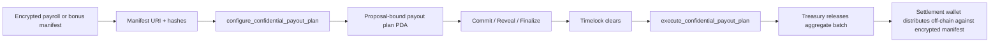

<!-- SPDX-License-Identifier: AGPL-3.0-or-later -->
# Confidential Payments Diagram

## Reading The Diagram

- The encrypted manifest stays off-chain.
- The proposal-bound payout plan PDA becomes the immutable on-chain reference.
- Governance approves the aggregate batch through the standard lifecycle.
- The treasury releases only the aggregate amount to the settlement recipient.

## Why This Matters

The model keeps compensation operations:

- reviewable
- proposal-scoped
- timelocked
- replay-resistant

without forcing the DAO to publish the full payroll sheet on-chain.
