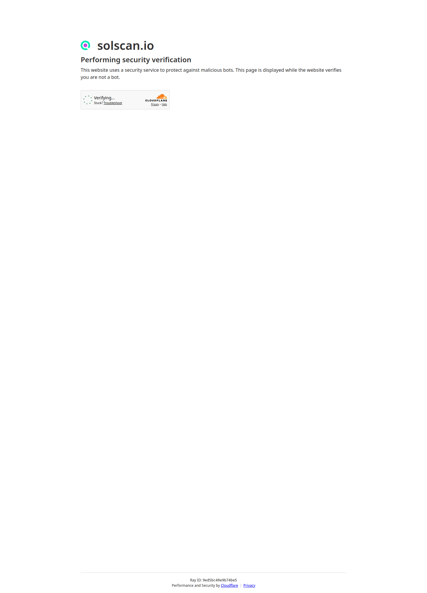
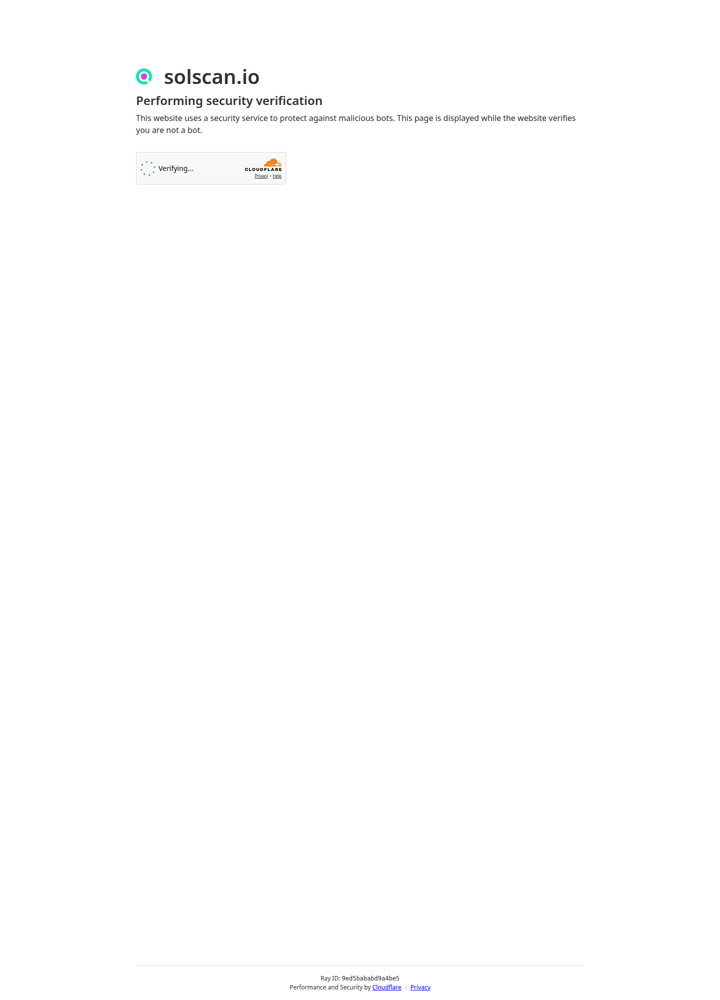
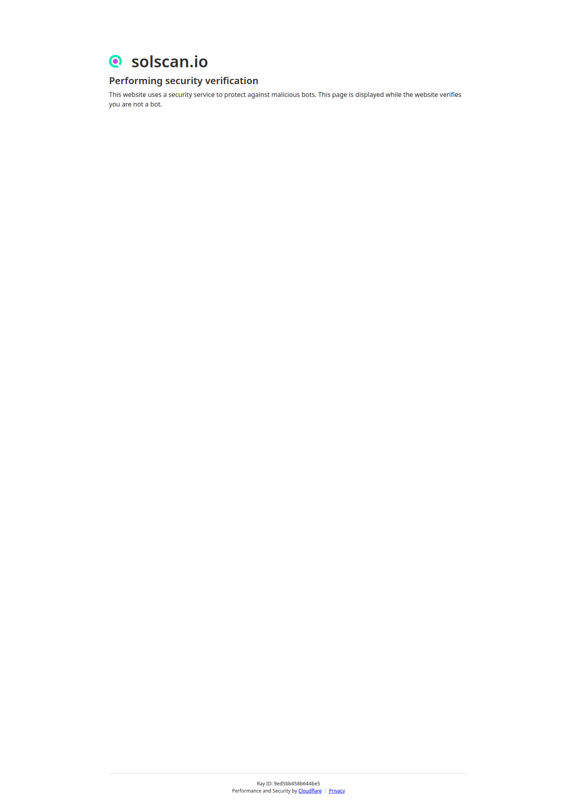

# Devnet Execution Screenshots

## Purpose

This packet gives a non-technical reviewer direct visual proof that the current PrivateDAO execution corridor is not just described in text.

It shows real Devnet transaction pages and the execution wallet used by the current Agentic Treasury Micropayment Rail.

## What this proves

- the rail executed real on-chain settlements
- the actions are explorer-visible
- the same feature shown in `/judge/` and `/documents/agentic-treasury-micropayment-rail/` is backed by public Devnet records
- a normal reviewer can verify the product without running local scripts first

## Canonical review route

1. Open `https://privatedao.org/judge/`
2. Confirm the proposal lifecycle and the micropayment rail summary
3. Open these screenshots if you want the fast visual proof packet
4. Open the live explorer links below for the raw chain records

## Execution wallet

- Wallet: `4Mm5YTRbJuyA8NcWM85wTnx6ZQMXNph2DSnzCCKLhsMD`
- Solscan: `https://solscan.io/account/4Mm5YTRbJuyA8NcWM85wTnx6ZQMXNph2DSnzCCKLhsMD?cluster=devnet`

## Captured transaction screenshots

### Recipient activation

- Explorer: `https://solscan.io/tx/4LRDNo1wU9UnMmMbfBa33mSr42x1rm3UdqVq5LZDigSK2xYUvaBEZmTNWDDQPLrfAF5S1uBbGDReVKoLYe2jMwUr?cluster=devnet`

### Proposal approved

- Explorer: `https://solscan.io/tx/4iLfBSScFfaSJ6deu7SGYBPmBeNu6Hz5BfC1wohjttTkf4fK2mVCuZmKUb4mqpBdc6AJZKf7DyvwyEgJhvUbxvHW?cluster=devnet`

### Vote settled

- Explorer: `https://solscan.io/tx/2mNG6hSGHUt4GxYR9JYAfmeTE8WqqK3B7uNJKqXN5gUtdBkhMqbNNKKfjotSg7etGGEjoPnWWaM9sDJ6AXgrFakB?cluster=devnet`

### Execute settled

- Explorer: `https://solscan.io/tx/XoJYrxydLNA2te6nnp1FuZi4L2U9zjfgjaayDRbewTr3LDLYkQXW6s57sG7rGYspk4HBPL2ZLYMZd9fWrSUmtTF?cluster=devnet`

## How to read this packet

- The screenshots are the fast visual layer.
- The generated rail packet is the structured evidence layer.
- The judge route is the shortest operational proof layer.

Use all three together:

- `/judge/`
- `/documents/agentic-treasury-micropayment-rail/`
- this screenshots packet
