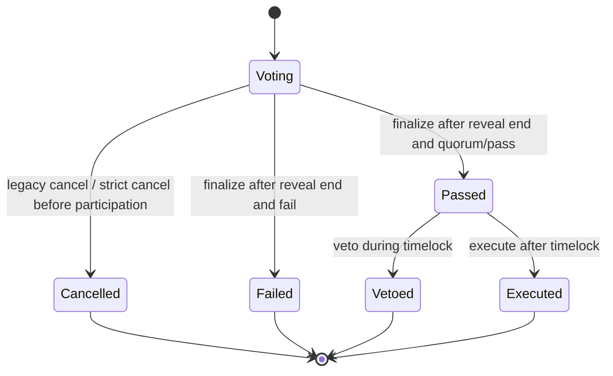
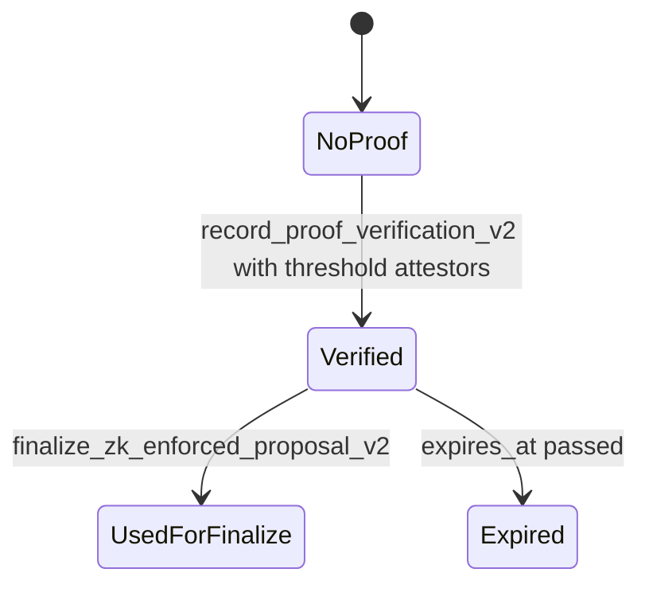
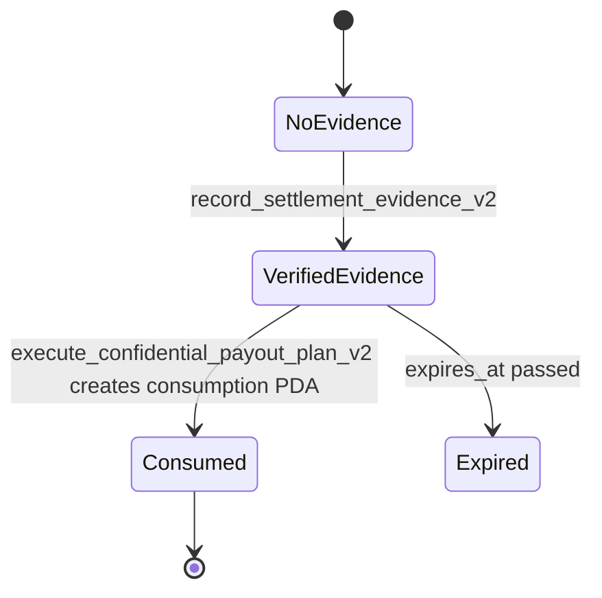

# PrivateDAO V2 Security Hardening

This document describes the additive hardening layer introduced after the security review of `programs/private-dao/src/lib.rs`.

The goal is not to break legacy accounts, PDAs, or instruction interfaces. Legacy flows remain readable and callable. New strict guarantees are exposed through companion accounts and V2 instructions.

## Compatibility Model

- Existing account layouts are not reordered.
- Existing PDA derivations are not changed.
- Existing instructions are not removed.
- Strict behavior is opt-in through companion policy accounts.
- Proposal behavior is snapshotted at the object level so future DAO policy changes do not silently reinterpret old proposals.

## New Companion Accounts

- `DaoSecurityPolicy`
  Stores rollout mode, feature policies, cancel policy, proof attestors, settlement attestors, thresholds, TTLs, and emergency disable state.
  Initialization is idempotent only for the exact same configuration. Policy evolution uses `update_dao_security_policy_v2`, which rejects rollbacks to weaker enforcement.

- `ProposalExecutionPolicySnapshot`
  Stores the DAO policy mode and feature policies captured for a specific proposal at the time the strict path is selected.
  Once populated, the snapshot is immutable except for an idempotent repeat under the exact same policy.

- `ProposalProofVerification`
  Stores verified proof metadata with explicit `VerificationStatus`, canonical payload binding, domain separator, expiry, and verification kind.

- `SettlementEvidence`
  Stores source-specific settlement evidence with `SettlementEvidenceKind`, `EvidenceStatus`, settlement identifier, exact payout-field binding, expiry, and recorder.

- `SettlementConsumptionRecord`
  A single-use PDA keyed by settlement evidence. If it already exists, the same evidence cannot execute a payout again.

- `VoterWeightScopeRecord`
  Adds explicit chamber/scope semantics to the legacy Realms-compatible voter weight record.

## ZK-Enforced Governance

Root cause:
Legacy ZK receipts were anchored metadata and administrative attestations, not cryptographic verification.

Strict V2 objective:
A proposal using the strict path cannot finalize unless `ProposalProofVerification` exists, has `status == Verified`, is fresh, binds to the exact proposal, and matches the canonical payload hash.

Canonical payload hash:
The strict payload hash is not a free-form label. It is derived from the V2 domain tag, DAO, proposal, and object version in the current implementation. Any later instruction-bundle verifier must extend this canonical serialization, not replace it ad hoc. The required extension set for a treasury or payout payload is:

- target instruction family
- DAO
- proposal
- object version
- treasury source
- account metas relevant to execution
- recipient
- mint or native-SOL marker
- amount
- confidential payout plan when present
- settlement or proof domain tag

Implementation:
- `record_proof_verification_v2`
- `finalize_zk_enforced_proposal_v2`
- `ProposalProofVerification`
- `ProposalExecutionPolicySnapshot`

Trust model:
The current production-safe fallback is threshold attestation. The attestors and threshold are encoded on-chain in `DaoSecurityPolicy`, and enough attestors must sign the transaction. This is an explicit attested fallback, not a fake cryptographic verifier claim. A future cryptographic verifier CPI can be added as another `VerificationKind` without breaking legacy state.

Invariant:
Strict V2 finalization fails if proof status is not verified, proof is stale, domain separator mismatches, or payload hash does not match the canonical proposal payload.

Overwrite resistance:
Once a strict `ProposalProofVerification` PDA is populated, it cannot be rewritten with a different payload, proof hash, public-input hash, verification-key hash, kind, or domain separator. Repeating the exact same still-fresh record is idempotent; substituting a new payload requires a new proposal-bound PDA.

## REFHE and MagicBlock Settlement

Root cause:
Legacy settlement status was stored as proposal-bound metadata, but external settlement was not independently verified on-chain.

Strict V2 objective:
Confidential payout execution must fail unless a verified, fresh, authorized, proposal-bound, payout-bound, single-use evidence account exists.

Implementation:
- `record_settlement_evidence_v2`
- `execute_confidential_payout_plan_v2`
- `SettlementEvidence`
- `SettlementConsumptionRecord`

Invariant:
Strict V2 payout execution fails if evidence is stale, not verified, mismatched to another DAO/proposal/payout plan, mismatched to canonical payout fields, or already consumed.

Consumption semantics:
Settlement consumption is enforced by a single-use PDA derived from `["settlement-consumption", settlement_evidence]`. This intentionally avoids zero-value sentinel checks. If the consumption account already exists, the same evidence cannot be reused.

Overwrite resistance:
Once a strict `SettlementEvidence` PDA is populated, it cannot be rewritten with a different evidence kind, status, settlement id, evidence hash, or payout-field hash. If a settlement needs a new receipt, it must use a distinct settlement id and therefore a distinct evidence PDA.

## Cancellation

Root cause:
Legacy `cancel_proposal` could cancel a proposal while status remained `Voting`, including after meaningful participation.

Strict V2 objective:
Ordinary cancellation must not be allowed after meaningful participation.

Implementation:
- `cancel_proposal_v2`
- `DaoSecurityPolicy.cancel_policy`

Invariant:
Strict V2 cancellation requires `status == Voting`, current time before `voting_end`, `commit_count == 0`, and `reveal_count == 0`.

## Realms Voter Weight

Root cause:
Legacy `DualChamber` export mapped to the community chamber weight but did not encode the chamber semantics in a separate record.

Strict V2 objective:
New integrations can request and inspect an explicit voter weight scope.

Implementation:
- `update_voter_weight_record_v2`
- `VoterWeightScopeRecord`

Invariant:
New integrations can distinguish token-weighted, quadratic, capital-leg, and community-leg semantics without changing the legacy Realms-compatible account layout.

## Rollout Plan

1. Ship additive accounts and V2 instructions.
2. Keep existing DAOs in legacy mode by default.
3. Initialize `DaoSecurityPolicy` for DAOs that want strict rollout.
4. Snapshot proposal policy with `snapshot_proposal_execution_policy` before using strict V2 finalization or settlement execution.
5. Use threshold attestation until a dedicated verifier CPI is available.
6. Add verifier-CPI support as a new `VerificationKind` in a later additive upgrade.
7. Recommend strict mode after tests, external review, and operational attestor setup are complete.

## Policy transition invariants

- `LegacyAllowed` means legacy instructions remain callable and historical objects are not reinterpreted.
- `CompatibilityRequired` means legacy state remains readable while new strict flows should snapshot object policy before using V2 finalization or V2 settlement execution.
- `StrictRequired` means newly selected V2 paths must provide companion proof or settlement accounts.
- `update_dao_security_policy_v2` is monotonic: it can move a DAO toward stronger enforcement, but it cannot roll policy mode, proof policy, settlement policy, or cancellation policy back to a weaker setting.
- A future DAO-wide policy change does not silently change a proposal that already has a `ProposalExecutionPolicySnapshot`.
- A proposal policy snapshot cannot be overwritten with a different policy after it is recorded.
- Legacy proposals can only become strict when the necessary companion accounts are explicitly provided and pass the V2 gates.

## State Transition Diagrams

Proposal lifecycle:

Strict proof lifecycle:

Strict settlement lifecycle:

## Regression Tests Added

- Policy snapshot creation.
- Idempotent security-policy initialization without silent overwrite.
- Monotonic DAO policy update.
- Proposal policy snapshot overwrite rejection after DAO-wide policy changes.
- Threshold-attested proof verification record creation.
- Payload substitution failure for strict finalization.
- Correct payload reaches lifecycle timing checks instead of failing proof binding.

Further test work should add live full-path `execute_confidential_payout_plan_v2` settlement consumption checks on an AVX2-capable local validator or Devnet test account.

## Audit checklist delta

- Payload substitution must fail.
- Proof and settlement companion PDA overwrite with different strict data must fail.
- Cross-DAO proof and settlement replay must fail.
- Cross-proposal proof and settlement replay must fail.
- Double consumption of the same settlement evidence must fail by PDA existence.
- Late cancellation must fail on `cancel_proposal_v2` after any commit or reveal.
- Policy transitions must not reinterpret an already-snapshotted proposal.
